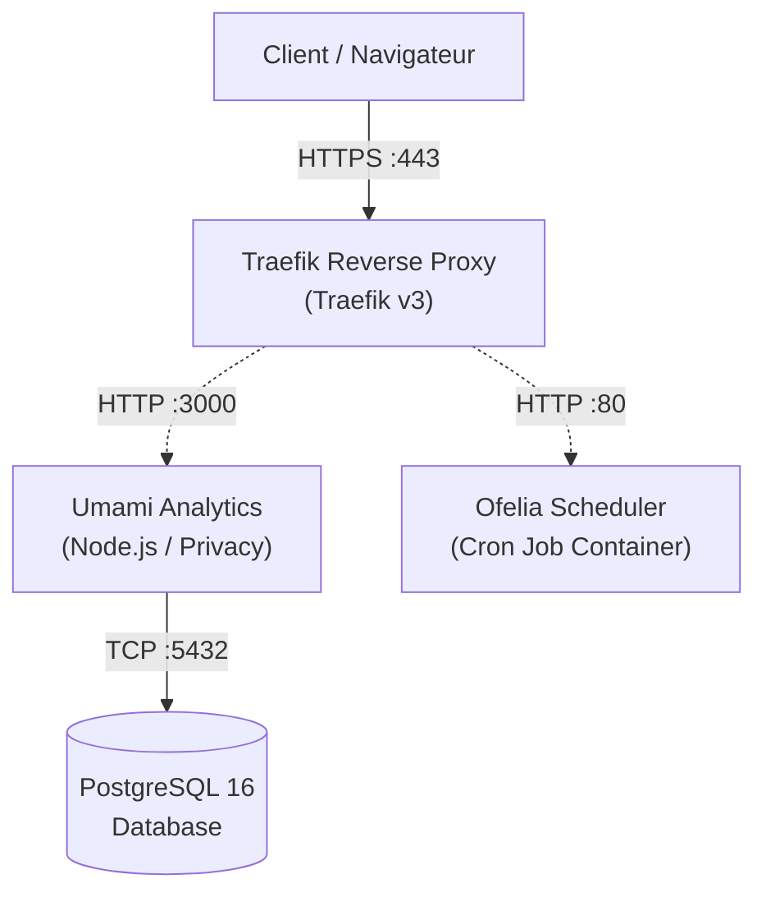
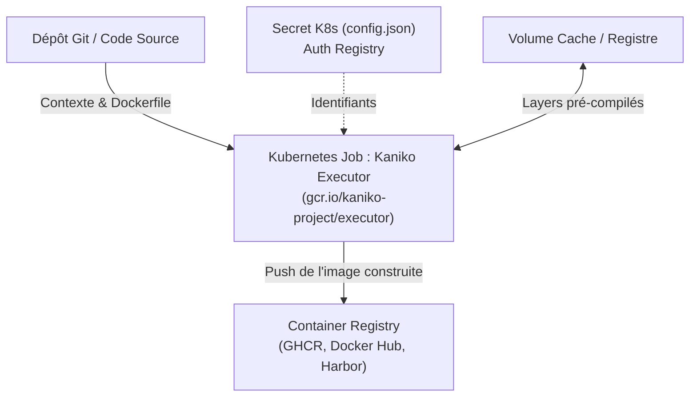
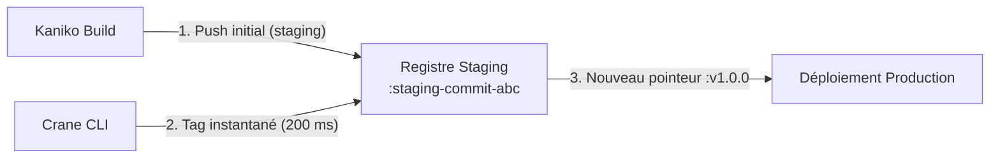
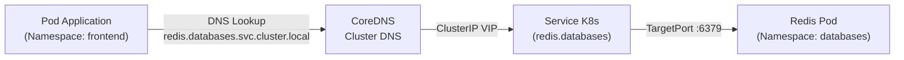

# Mermaid Diagram Examples for Docker & Kubernetes Architectures

This reference guide provides copy-paste ready Mermaid flowchart templates for Docker, Kubernetes, and CI/CD articles.

---

## 1. Homelab Reverse Proxy Architecture (Docker Compose + Traefik)

---

## 2. Docker Rootless Image Build (Kaniko + Kubernetes Job)

---

## 3. Fast Tag Promotion Pipeline (Crane)

---

## 4. Kubernetes Service FQDN Resolution

