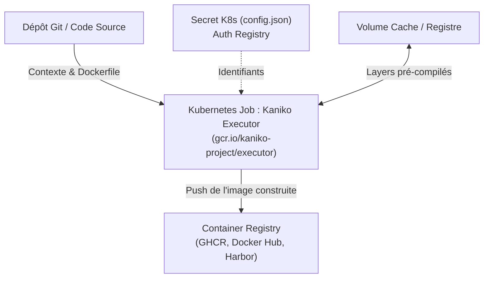
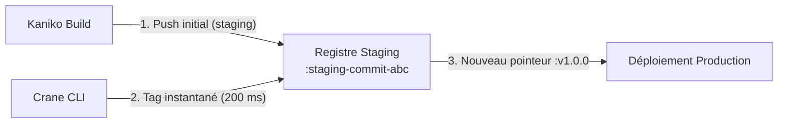

# Builder et Promouvoir des Images dans Kubernetes sans Docker : Le Duo Gagnant Kaniko + Crane

*Pendant des années, compiler une image Docker à l'intérieur d'un cluster Kubernetes nécessitait de monter `/var/run/docker.sock` ou de faire tourner Docker-in-Docker avec des privilèges root complets sur l'hôte physique. Aujourd'hui, l'association de Kaniko et Crane offre une chaîne de construction et de promotion 100% sécurisée, rootless et ultra-performante.*

---

## 🛑 Le Problème Historique : La Faille DooD (Docker-out-of-Docker)

Dans les architectures CI/CD traditionnelles exécutées sur Kubernetes (GitLab CI runners, Jenkins agents), la méthode la plus courante pour builder une image consistait à monter la socket de l'hôte :

```yaml
# L'ANTI-PATTERN DE SÉCURITÉ MAJEUR
volumeMounts:
  - mountPath: /var/run/docker.sock
    name: docker-socket
securityContext:
  privileged: true # Donne les droits root complets sur la machine hôte !
```

### Pourquoi c'est critique en entreprise et en homelab ?
1. **Escalade de privilèges immédiate** : Tout conteneur ayant accès au socket Docker peut exécuter `docker run -v /:/hostroot` et prendre le contrôle total du serveur hôte.
2. **Incompatibilité avec les runtimes modernes** : Les distributions Kubernetes récentes (dont K3s) utilisent **containerd** ou **CRI-O**, rendant l'attente d'un daemon Docker caduque.

Pour résoudre ce paradoxe, le projet open-source initié par Google a introduit **Kaniko** et **Crane**.

---

## 🔨 1. Kaniko : Le Constructeur d'Images en Userspace (Rootless)

**Kaniko** est un utilitaire conçu pour construire des images de conteneurs à partir d'un `Dockerfile`, **entièrement à l'intérieur de l'espace utilisateur d'un conteneur**, sans dépendre d'aucun daemon externe.



### Comment fonctionne Kaniko sous le capot ?
1. **Extraction de l'image de base** : Kaniko télécharge le système de fichiers racine de l'image (`FROM python:3.11-slim`) et le décompresse dans son propre espace de travail.
2. **Exécution isolée des commandes `RUN`** : Chaque directive du Dockerfile (ex: `RUN uv sync --compile-bytecode`) s'exécute dans l'espace utilisateur.
3. **Calcul de snapshots différentiels** : Après chaque commande, Kaniko compare le système de fichiers avec l'étape précédente, crée une couche d'archive `.tar` et calcule son digest SHA256.
4. **Mise en cache intelligente (`--cache=true`)** : Les couches déjà compilées peuvent être mises en cache localement ou sur le registre pour réduire le temps de build de 80%.
5. **Push direct** : Kaniko utilise le secret d'authentification monté (`/kaniko/.docker/config.json`) pour pousser les layers et le manifeste OCI final.

### Exemple de Job Kubernetes Kaniko :
```yaml
apiVersion: batch/v1
kind: Job
metadata:
  name: kaniko-builder
spec:
  template:
    spec:
      restartPolicy: Never
      containers:
        - name: kaniko
          image: gcr.io/kaniko-project/executor:latest
          args:
            - "--context=git://github.com/votre-orga/votre-projet.git#refs/heads/main"
            - "--dockerfile=Dockerfile"
            - "--destination=ghcr.io/votre-orga/mon-api:staging"
            - "--cache=true"
          volumeMounts:
            - name: reg-cred
              mountPath: /kaniko/.docker
      volumes:
        - name: reg-cred
          secret:
            secretName: kaniko-registry-secret
            items:
              - key: .dockerconfigjson
                path: config.json
```

---

## 🦩 2. Crane : L'Opérateur de Registre à Haute Vitesse

Si **Kaniko** s'occupe de la fabrication (*build*), **Crane** (issu du projet officiel Google `go-containerregistry`) est le couteau suisse pour manipuler, inspecter et promouvoir les images **directement sur le registre distant**.

### La Règle d'or en CI/CD : "Build Once, Promote Everywhere"
Une erreur classique consiste à recompiler le code source pour passer d'un environnement de staging à la production. En bonne pratique DevOps, **l'artefact binaire testé et validé en staging doit être rigoureusement identique en production**.

C'est là que Crane intervient avec une efficacité redoutable :



---

## ⚡ Les 4 Commandes Essentielles de Crane

### 1. Promouvoir une image instantanément (Zero Rebuild)
Crane crée un nouveau tag pointant sur le même digest SHA256 directement sur l'API du registre, en moins de **200 millisecondes**, sans télécharger un seul octet :
```bash
crane tag ghcr.io/kamitbrains/mon-api:staging-commit-abc v1.0.0
```

### 2. Copier une image de registre à registre en streaming HTTP
Pour répliquer une image publique vers votre registre privé (très utile en environnement Air-Gap ou pour éviter les rate-limits de Docker Hub) :
```bash
crane copy <SOURCE> <DESTINATION>

# Exemple concret :
crane copy couchdb:3.4 ghcr.io/kamitbrains/couchdb:3.4
```
> **Le secret** : Crane demande au registre distant de streamer directement les couches vers le second registre, sans jamais saturer l'espace disque de votre machine locale.

### 3. Extraire le Digest SHA256 immuable
En production Kubernetes, utiliser le tag `:latest` est une mauvaise pratique car l'image peut changer sans mise à jour du manifeste. Crane extrait le SHA256 exact :
```bash
crane digest ghcr.io/kamitbrains/mon-api:v1.0.0
# Résultat : sha256:4a2f1b88e0192837...
```

### 4. Inspecter un Manifeste OCI sans télécharger l'image
Pour vérifier l'architecture CPU (`amd64` vs `arm64`) ou les variables d'environnement d'une image de 2 Go en 1 seconde :
```bash
crane manifest ghcr.io/kamitbrains/mon-api:v1.0.0 | jq .
crane config ghcr.io/kamitbrains/mon-api:v1.0.0 | jq .config.Env
```

---

## 🎯 Synthèse : Comparatif des Outils

| Fonctionnalité | Docker Daemon traditionnel | Kaniko | Crane |
| :--- | :--- | :--- | :--- |
| **Sécurité d'exécution** | Nécessite socket root (`docker.sock`) | **100% Userspace (Rootless)** | **Client CLI sans daemon** |
| **Contexte de build** | Machine locale / VM | **Kubernetes Job natif** | N/A (ne builde pas) |
| **Promotion d'image** | `docker pull` + `tag` + `docker push` (lourd) | Rebuild nécessaire | **Instantané via API OCI (200 ms)** |
| **Copie inter-registres** | Télécharge tout sur le disque local | N/A | **Streaming distant direct** |

Adopter le tandem **Kaniko + Crane** permet d'aligner son infrastructure sur les standards de sécurité les plus stricts tout en fluidifiant la chaîne de déploiement continu.
