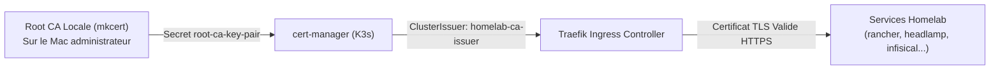

# Du Bare-Metal au Cloud-Native : Déployer un Cluster K3s Air-Gap avec Rancher, Infisical, Valkey et Faster-Whisper

*Comment concevoir une infrastructure d'entreprise souveraine et auto-hébergée sur un mini-PC compact (4 cœurs / 8 vCPU, 32 Go RAM, 1 To NVMe) avec l'écosystème Kubernetes moderne, sans compromis sur la sécurité ni la performance.*

---

## 🎯 Le Défi : Passer de Docker Compose à un véritable Orchestrateur K8s

Les architectures multi-conteneurs basées sur Docker Compose sont idéales pour démarrer. Cependant, dès lors que l'on recherche une **haute résilience**, une **isolation multi-tenant stricte par namespaces**, une **sécurisation native des secrets** et une **gestion de cycle de vie déclarative (GitOps)**, Kubernetes s'impose naturellement.

Sur un serveur hôte physique type Mini-PC compact (**Acemagic K1 Mini**), l'enjeu était triple :
1. **Économie de ressources** : Faire tourner un plan de contrôle Kubernetes sans sacrifier 8 Go de RAM rien que pour le moteur d'orchestration.
2. **Déploiement Air-Gap automatisé** : Piloter l'installation via Ansible avec des binaires et images pré-packagés, garantissant une reproductibilité totale sans dépendre de dépôts tiers instables.
3. **Sécurité dès la conception (Zero-Trust & Root CA locale)** : Valider tous les certificats TLS de nos Ingress avec notre propre Root CA (`mkcert` + `cert-manager`) et centraliser les identifiants avec **Infisical**.

---

## 🧱 Fondations : K3s en Mode Air-Gap via Ansible

Pour garantir une installation déterministe et isolée du réseau public, nous avons opté pour la collection officielle `k3s-io/k3s-ansible` avec **K3s v1.31** :

```text
ansible/
├── k3s-io-deploy.yml         # Playbook de déploiement officiel
├── k3s-io-reset.yml          # Décommissionnement propre et idempotent
├── k3s-io-inventory.yml      # Inventaire ciblant le nœud K1 Mini
└── airgap/                   # Artefacts pré-téléchargés (binaire k3s + tarball d'images)
```

Grâce à son architecture allégée (remplacement d'etcd par SQLite embarqué pour les clusters mono-nœuds, containerd et proxy réseau intégré), K3s ne consomme que **~500 Mo de RAM au repos**, laissant plus de 30 Go disponibles pour les charges de travail applicatives.

---

## 🔒 Sécurité & TLS Automatique avec Root CA Locale

L'exposition des services internes repose sur **Traefik Ingress** et l'opérateur **`cert-manager`**. 

Plutôt que d'accepter des alertes de sécurité dans le navigateur ou de recourir à des certificats auto-signés éphémères, nous avons intégré notre autorité de certification locale (`mkcert`) au cluster :



Chaque `Ingress` annoté avec `cert-manager.io/cluster-issuer: homelab-ca-issuer` reçoit instantanément un certificat TLS valide reconnu par l'ensemble des postes de travail du réseau local.

---

## 🧭 DNS Interne & Découverte de Services : Comprendre le FQDN Kubernetes

L'une des transitions majeures par rapport à Docker Compose et Swarm réside dans la résolution de nom et la découverte de services (*Service Discovery*). 

Dans notre cluster, un service s'adresse via son nom pleinement qualifié (**FQDN**) :
```text
redis://redis.databases.svc.cluster.local:6379
```

### Anatomie du FQDN à 4 Segments :
$$\underbrace{\text{redis}}_{\text{1. Service}}.\underbrace{\text{databases}}_{\text{2. Namespace}}.\underbrace{\text{svc}}_{\text{3. Type d'objet}}.\underbrace{\text{cluster.local}}_{\text{4. Racine DNS Cluster}}$$

| Couche | Rôle | Avantage par rapport à Docker Compose / Swarm |
| :--- | :--- | :--- |
| **`redis`** | Nom de l'objet `Service` K8s | Découplé du cycle de vie des pods. L'IP virtuelle (**ClusterIP**) ne change jamais. |
| **`databases`** | Namespace d'isolation | **Multi-tenancy réel** : Permet d'avoir un service `redis` dans `databases`, un autre dans `staging` et un dans `prod` sans aucun conflit de nom. |
| **`svc`** | Type d'enregistrement DNS | Distingue les services permanents des adresses IP directes de pods (`pod`). |
| **`cluster.local`** | Racine gérée par **CoreDNS** | Évite les ambiguïtés et permet la résolution inter-clusters. |

---

## 🦭 De Redis à Valkey : La Souveraineté de l'In-Memory Cache

Suite au changement de licence de Redis vers des modèles propriétaires (RSALv2/SSPLv1), nous avons fait le choix stratégique de basculer vers **Valkey 8** (le fork officiel sous gouvernance de la **Linux Foundation**, soutenu par AWS, Google Cloud et Red Hat).

- **100% Compatible (Drop-in Replacement)** : Protocole RESP identique, zéro modification de code dans nos applications.
- **Mutualisation des Ressources** : Une instance unique de Valkey (`redis.databases.svc:6379`) avec persistance AOF dessert à la fois les files de tâches de nos APIs et le cache d'Infisical.
- **Une bascule progressive** : les charges que nous maîtrisons sont sur Valkey. Les stacks tierces qui épinglent Redis en amont (Coolify, Tyk) restent sur `redis:7-alpine` — les migrer de force reviendrait à sortir de leur matrice de support.

---

## 🔐 Gestion Centralisée des Secrets avec Infisical

La gestion des identifiants et des variables d'environnement en production interdit tout stockage en clair dans les dépôts Git. 

Nous avons déployé **Infisical Standalone** sur K3s dans le namespace `security` :
1. **Mutualisation de la Persistance** : La base de données `infisical` est hébergée sur notre pod **PostgreSQL 16** (`postgres.databases.svc:5432`) existant, et le cache sur **Valkey 8**.
2. **Zéro Secret dans Git** : Les manifestes `Deployment` et `Ingress` sont commités sans valeur sensible. Les clés maîtresses de chiffrement (`ENCRYPTION_KEY`, `AUTH_SECRET`) sont injectées dynamiquement au déploiement depuis un dossier local protégé `.secrets/`, via `envFrom.secretRef` :

```yaml
envFrom:
  - secretRef:
      name: infisical-secrets
```
```bash
kubectl create secret generic infisical-secrets \
  --from-env-file=.secrets/infisical.env -n security
```

> **La règle vaut pour tout le cluster, pas seulement Infisical.** C'est le point
> où l'on dérape le plus facilement : un `POSTGRES_PASSWORD` écrit en clair dans un
> `Deployment` « juste pour tester » finit commité, et le retirer ensuite impose une
> réécriture d'historique Git. Le réflexe : `valueFrom.secretKeyRef` dès la première
> version du manifeste, jamais `value:`.
3. **Accès Web sécurisé** : Disponible sur `https://infisical.kamitbrains-minipc-k1.lab` avec rotation et audit des accès.

---

## 🎙️ IA Locale & Speech-to-Text : Faster-Whisper (Wyoming)

Pour doter le homelab de capacités de reconnaissance vocale souveraines sans dépendre d'APIs Cloud tierces (OpenAI), nous avons intégré **Faster-Whisper** (`lscr.io/linuxserver/faster-whisper:latest`) dans le namespace `ai` :

- **Optimisation CPU x86** : Basé sur **CTranslate2** avec modèles quantifiés en `int8` (`base-int8` / `small-int8`). L'inférence s'effectue en ~0.5 à 1 seconde par phrase sur les 8 vCPU du K1 Mini sans nécessiter de carte graphique dédiée.
- **Protocole Wyoming** : Écoute sur le port TCP `10300`, prêt à être consommé par **Home Assistant** ou nos agents conversationnels locaux.
- **Modèles Persistants** : Volume persistant `local-path` de 10 Gi pour éviter de retélécharger les poids de HuggingFace à chaque redémarrage.

---

## 📱 L'Écosystème des Application Dashboards

Pour fédérer l'accès aux dizaines d'applications du cluster (Rancher, Headlamp, Uptime Kuma, Glances, Umami, CouchDB, Faster-Whisper), le choix du tableau de bord d'accueil est déterminant :

| Dashboard | Approche & Points Forts | Idéal pour |
| :--- | :--- | :--- |
| **Homepage** *(Notre choix)* | **100% Déclaratif & GitOps** : Configuré par YAML / ConfigMaps K8s, zéro base de données, widgets natifs (CPU, mémoire, pods K8s). | Homelabs orientés **DevOps & Automatisation**. |
| **Homarr** | **Modulaire & Visuel** : Système en grille dynamique avec glisser-déposer (*drag-and-drop*) et personnalisation visuelle. | Utilisateurs préférant **tout gérer à la souris**. |
| **Heimdall** | **Lanceur épuré** : Solution classique (PHP/Laravel), simple mur d'icônes avec liens directs. | Besoins de **favoris partagés simples**. |

D'autres options notables existent selon les sensibilités :
- **Dashy** : Pour les passionnés de personnalisation CSS/UI extrême.
- **Glance** : Pour une page de démarrage minimaliste avec flux RSS et météo.
- **Homer / Flame / SUI** : Pour des annuaires de liens ultra-légers sans widgets complexes.

---

## 🚀 Conclusion & Prochaines Étapes

Transformer un serveur matériel compact en cluster Kubernetes moderne prouve qu'une infrastructure auto-hébergée peut rivaliser en élégance et en sécurité avec les meilleures plateformes Cloud professionnelles.

Les prochaines étapes de notre roadmap :
- **GitOps avec ArgoCD** pour automatiser la synchronisation des manifests depuis Git.
- **Compilation in-cluster avec Kaniko** pour construire nos images de conteneurs de manière sécurisée (rootless) sans daemon Docker.
- **Conteneurs de bureaux virtuels avec Selkies / Webtop** pour streamer des interfaces graphiques Linux ultra-rapides en WebRTC dans le navigateur.
