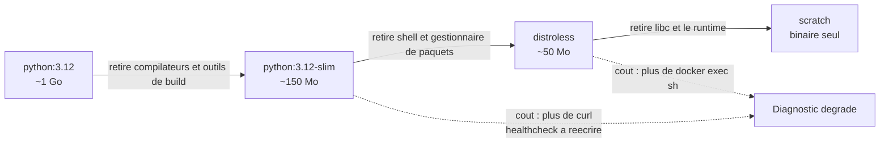

# Distroless : Chaque Outil Retiré est un Outil qui Manquera à 3h du Matin

*On présente généralement les images distroless comme un gain net : plus petites, moins de CVE, surface d'attaque réduite. Le raisonnement est juste, mais il omet la contrepartie — et celle-ci ne se manifeste jamais au moment du build. Elle se manifeste en incident, ou dans un job de CI qui refuse de démarrer sans expliquer pourquoi.*

---

## 🔍 Un Commentaire Révélateur

Dans le template de déploiement d'une plateforme sur laquelle je travaille, le healthcheck du backend est déclaré ainsi :

```yaml
healthcheck:
  # Image runtime slim n'a ni curl ni procps : utiliser Python stdlib.
  test: ["CMD-SHELL", "python -c 'import urllib.request as u,sys;
         sys.exit(0 if u.urlopen(\"http://localhost:80/healthcheck\").status==200 else 1)'"]
```

Ce commentaire mérite qu'on s'y arrête. Personne, dans ce projet, n'a jamais employé le mot « distroless ». L'image de base est un banal `python:3.12-slim`. Et pourtant, la contrainte est déjà là : un `curl -f http://localhost/healthcheck`, l'idiome le plus courant du monde Docker, **n'était pas disponible**. Il a fallu réécrire le test de santé en bibliothèque standard Python.

Le durcissement avait commencé sans qu'on le nomme, et il avait déjà coûté quelque chose.

C'est tout le sujet : **distroless n'est pas une catégorie, c'est une position sur un curseur** dont la plupart des équipes ont déjà franchi un ou deux crans sans s'en apercevoir.

---

## 📏 Le Curseur

| Étage | Ce qu'on y trouve | Taille type |
| :--- | :--- | :--- |
| `python:3.12` | Distribution complète, compilateurs, git, outils de build | ~1 Go |
| `python:3.12-slim` | Distro allégée — shell et `apt` conservés, la plupart des outils retirés | ~150 Mo |
| **distroless** | Interpréteur + bibliothèques runtime. **Aucun outil, aucun shell** | ~50 Mo |
| `scratch` | Rien du tout. Un binaire statique et c'est fini | taille du binaire |

Le nom « distroless » est d'ailleurs trompeur : il reste bien une base Debian en dessous — libc, OpenSSL, certificats racine, fuseaux horaires. Ce qui disparaît, ce n'est pas la distribution, c'est **l'outillage destiné aux humains** : `sh`, `bash`, `apt`, `apk`, `curl`, `wget`, `ls`, `ps`, `cat`.



---

## ✅ Le Gain, et Pourquoi il est Réel

L'argument principal n'est pas la taille — c'est la **surface d'attaque**.

Une grande partie des chaînes d'exploitation post-intrusion suppose l'existence d'un `/bin/sh`. Un attaquant qui obtient une exécution de code dans un conteneur distroless se retrouve sans shell pour pivoter, sans `curl` pour exfiltrer, sans gestionnaire de paquets pour installer son outillage. Ça ne rend pas l'attaque impossible — un exploit peut embarquer son propre code — mais ça élimine l'essentiel de ce qui est opportuniste.

Le second gain est plus terre à terre, et probablement celui qui convaincra votre équipe : **moins de paquets, donc moins de CVE à traiter**. Une bonne part de ce qu'un scanner remonte sur une image `slim` provient d'utilitaires que l'application n'appelle jamais. Ce ne sont pas des vulnérabilités théoriques — ce sont de vraies CVE, dans du code réellement présent — mais elles consomment un temps d'analyse considérable pour un risque souvent nul.

Détail utile : **les images distroless restent scannables**. Elles embarquent volontairement les métadonnées de paquets (`/var/lib/dpkg/status.d`) précisément pour que Trivy et consorts continuent de fonctionner. Passer distroless ne vous fait pas sortir des radars, ça réduit le bruit.

---

## 💥 Le Coût : un Pipeline qui Refuse de Démarrer

Voici le cas concret, rencontré en branchant [la signature d'images avec Cosign](/fr/blog/signer-images-docker-cosign-kubernetes-kyverno/).

L'image officielle de l'outil, `ghcr.io/sigstore/cosign/cosign`, est distroless. Son entrypoint est `/ko-app/cosign`. Le job de CI ressemblait à ça :

```yaml
sign-images:
  image:
    name: ghcr.io/sigstore/cosign/cosign:v2.4.1
  script:
    - cosign sign --key /tmp/cosign.key "${IMAGE_REF}"
```

Ça ne peut pas fonctionner. **GitLab CI enveloppe systématiquement le contenu de `script:` dans un shell** — il doit enchaîner des commandes, évaluer des variables, gérer les codes de retour. Sans `/bin/sh` dans l'image, le job échoue avant d'avoir exécuté la moindre ligne, avec un message qui ne pointe pas vers la cause réelle.

Le réflexe — « l'image officielle de l'outil doit être la bonne » — est précisément ce qui fait perdre du temps ici.

### L'asymétrie qu'il faut comprendre

Le plus instructif, c'est que **la même image fonctionne parfaitement ailleurs**. Dans la tâche Ansible de vérification, côté serveur :

```yaml
- name: Vérifier la signature des images
  shell: >
    docker run --rm -v {{ release_dir }}/cosign.pub:/cosign.pub:ro
    ghcr.io/sigstore/cosign/cosign:v2.4.1
    verify --key /cosign.pub {{ item }}
```

Ici, `docker run` passe `verify --key …` directement en arguments de l'entrypoint. Aucun shell n'est nécessaire **à l'intérieur** du conteneur — le shell qui interprète la commande est celui de l'hôte.

D'où la règle à retenir, qui n'est pas une propriété de l'image mais de son appelant :

| Contexte | Image distroless utilisable ? |
| :--- | :--- |
| `docker run image cmd args` | ✅ L'entrypoint est appelé directement |
| `ENTRYPOINT` d'un conteneur applicatif | ✅ C'est l'usage prévu |
| `script:` GitLab CI / `run:` GitHub Actions | ❌ Le runner enveloppe dans un shell |
| `command: ["sh", "-c", "..."]` en Compose ou K8s | ❌ Pas de `sh` |
| `docker exec … sh` pour diagnostiquer | ❌ Et c'est le vrai coût |

La solution retenue en CI a été d'installer le binaire sur une base `alpine`, avec vérification du SHA-256 de la release — ce qui a au moins le mérite d'appliquer au vérificateur la rigueur qu'on attend de lui.

---

## 🐛 Les Tags `:debug`, ou l'Aveu

L'écosystème a rapidement reconnu le problème. La plupart des images distroless publient une variante `:debug` qui **réintroduit busybox** — donc un shell et une poignée d'utilitaires.

Vous en utilisez probablement déjà une sans y penser. Dans les pipelines qui construisent des images en cluster, on trouve presque toujours :

```yaml
image:
  name: gcr.io/kaniko-project/executor:v1.14.0-debug   # ← le "-debug" n'est pas décoratif
```

Sans ce suffixe, le job ne démarre pas. Le `-debug` n'est pas là pour déboguer : **il est là pour que ça marche du tout**.

Il y a une ironie à noter. Si votre variante `:debug` finit en production « parce que c'est plus pratique », vous avez payé toute la complexité du distroless pour n'en retirer aucun bénéfice. Le choix doit être explicite et documenté, pas subi.

Sur Kubernetes, la sortie propre existe : les **ephemeral containers** (`kubectl debug`) permettent d'attacher un conteneur outillé à un pod en cours d'exécution, sans jamais mettre de shell dans l'image applicative. C'est la bonne réponse — encore faut-il que les équipes d'astreinte sachent que ça existe, et que le RBAC l'autorise. Sans cette préparation, le durcissement sera contourné dans l'urgence.

---

## 📉 Le Coût Silencieux : la Dérive Documentaire

Retour au commentaire du début :

> `# Image runtime slim n'a ni curl ni procps : utiliser Python stdlib.`

En vérifiant, le Dockerfile correspondant installe bel et bien `curl` et `procps` — ajoutés plus tard, pour une dizaine de mégaoctets, afin de faciliter le diagnostic. **Le commentaire est faux depuis des mois**, et le healthcheck reste écrit en Python stdlib pour une contrainte qui n'existe plus.

Personne n'a fait d'erreur. C'est le mode de défaillance normal de ces contraintes : elles sont contournées une fois, le contournement est documenté, puis la contrainte évolue et le contournement demeure. Le coût du durcissement n'est pas seulement technique, il est **documentaire** — et il se paie en confusion, longtemps après.

Une contrainte de durcissement mérite donc d'être inscrite à l'endroit où elle est vérifiable (le Dockerfile), pas seulement là où elle est subie (le template de déploiement).

---

## 🚫 Quand ne PAS Passer Distroless

Le conseil le plus utile est souvent l'inverse de celui qu'on attend. Sur le backend FastAPI que j'évoquais, **je ne recommande pas le passage en distroless**, pour trois raisons :

1. **Dépendances natives.** L'application s'appuie sur cairo et pango pour générer des documents. Un multi-stage vers distroless exige d'identifier et recopier chaque bibliothèque partagée. C'est faisable, c'est fastidieux, et ça casse silencieusement au prochain ajout de dépendance.
2. **Le healthcheck est déjà contraint.** On a vu ce que le retrait de `curl` avait coûté. Descendre d'un cran supplémentaire rigidifie encore un mécanisme qui a déjà dû être contourné une fois.
3. **Le gain est marginal ici.** Ces conteneurs tournent sur des hôtes dédiés derrière un reverse proxy, pas sur un cluster multi-tenant. La surface qu'on retirerait n'est pas celle par laquelle une attaque arriverait le plus probablement.

En revanche, sur un microservice Go compilé statiquement, exposé sur Internet, sans dépendance native et avec un healthcheck implémenté dans le binaire lui-même : `scratch` ou distroless sont pleinement justifiés. **Le coût y est proche de zéro parce qu'il n'y avait rien à retirer.**

C'est le bon critère : *que perdez-vous, concrètement, le jour où il faut diagnostiquer ?* S'il n'y avait rien à perdre, descendez. Sinon, mesurez.

### Et Chainguard / Wolfi ?

Une alternative mérite d'être connue : les **Chainguard Images**, basées sur la distribution Wolfi, visent la même réduction de surface tout en fournissant un gestionnaire de paquets (`apk`) pour construire, des variantes `-dev` outillées, et un engagement sur le zéro-CVE connu. Le compromis est différent — la contrainte de build est moindre, la dépendance à un fournisseur tiers est réelle.

---

## 🎯 Synthèse

| Pratique | Effet réel |
| :--- | :--- |
| Passer distroless « parce que c'est plus sûr » | Gain réel, mais coût de diagnostic non budgété |
| Image distroless dans un `script:` de CI | **Le job ne démarre pas** — le runner exige un shell |
| Image distroless via `docker run img cmd` | ✅ Fonctionne — aucun shell requis dans le conteneur |
| Variante `:debug` déployée en production | Toute la complexité, aucun des bénéfices |
| Durcir sans préparer `kubectl debug` | Le durcissement sera contourné dans l'urgence |
| Contrainte documentée loin du Dockerfile | Commentaire périmé, contournement maintenu sans raison |
| Distroless sur un binaire Go statique | Coût quasi nul — rien à retirer |
| Distroless sur une app à dépendances natives | Fastidieux, fragile à chaque nouvelle dépendance |

Le durcissement d'image n'est pas une case à cocher dans un audit : c'est un arbitrage entre une surface d'attaque et une capacité de diagnostic. La bonne question n'est pas « est-ce que notre image est distroless ? », mais : **« qu'est-ce qu'on ne pourra plus faire le jour où ça tombera, et est-ce qu'on l'a préparé ? »**
