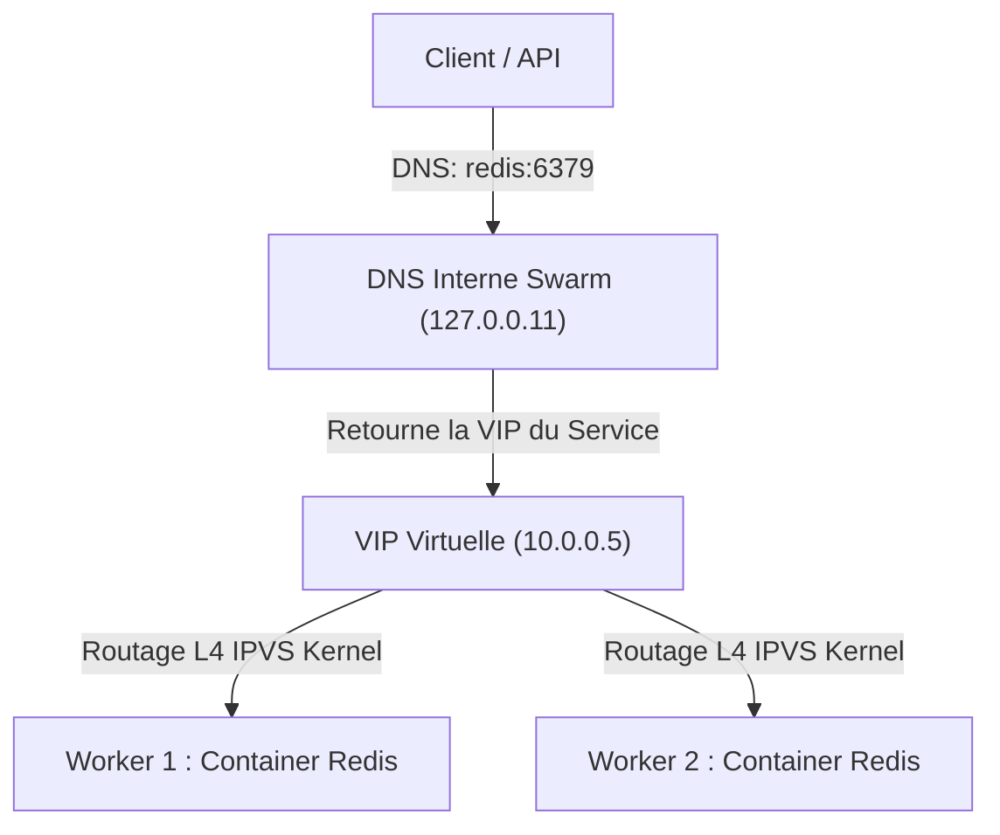

# Comprendre la Découverte de Services et le DNS : Kubernetes (FQDN & CoreDNS) vs Docker Compose vs Docker Swarm

*Pourquoi écrit-on simplement `redis:6379` dans Docker Compose, alors que Kubernetes exige souvent un nom hiérarchique comme `redis.databases.svc.cluster.local:6379` ? Analyse comparative des mécanismes de découverte de services (Service Discovery) et de résolution DNS.*

---

## 🎯 L'Enjeu de la Découverte de Services (*Service Discovery*)

Dans une architecture moderne en conteneurs ou microservices, les instances applicatives sont **éphémères** :
- Un conteneur qui plante redémarre avec une nouvelle adresse IP.
- Un mécanisme de montée en charge (*scaling*) ajoute dynamiquement des instances.
- Les adresses IP privées changent constamment.

Pour qu'un composant (ex: un backend FastAPI ou un gestionnaire de secrets comme Infisical) puisse communiquer de façon fiable avec sa base de données ou son cache, il ne peut pas s'appuyer sur des adresses IP statiques. C'est le rôle fondamental du **serveur DNS interne** et du mécanisme de **découverte de services**.

Pourtant, la manière dont Docker Compose, Docker Swarm et Kubernetes résolvent ce problème est radicalement différente.

---

## 1. 🐳 Docker Compose : La Simplicité du Réseau Bridge Local

Dans Docker Compose, la découverte de services est pensée pour un **hôte unique** :

```yaml
services:
  api:
    image: my-fastapi:latest
    environment:
      - REDIS_URL=redis://redis:6379

  redis:
    image: valkey/valkey:8-alpine
```

### Mécanisme interne :
1. Docker crée par défaut un pont réseau virtuel (**User-Defined Bridge Network**).
2. Le moteur Docker intègre un serveur DNS embarqué accessible à l'adresse fixe **`127.0.0.11`**.
3. Lorsque le conteneur `api` résout le nom `redis`, `127.0.0.11` lui renvoie directement l'adresse IP interne du conteneur (`172.18.0.x`).

### Les limites de Docker Compose :
- **Absence de multi-tenancy** : Si deux projets Compose différents utilisent un conteneur appelé `redis` sur le même réseau, il y a conflit de nommage immédiat.
- **Communication inter-stacks complexe** : Pour que deux fichiers `docker-compose.yml` distincts communiquent, il faut créer et déclarer manuellement un réseau externe partagé (`external: true`).

---

## 2. 🐝 Docker Swarm : Le Routage Multi-Hôtes par Overlay et VIP

Docker Swarm élève le concept au niveau d'un cluster multi-serveurs :



### Mécanisme interne :
1. **Réseau Overlay (VXLAN)** : Encapsule les paquets réseau pour relier les conteneurs répartis sur plusieurs machines physiques comme s'ils étaient sur le même switch.
2. **VIP (Virtual IP)** : Chaque service reçoit une adresse IP virtuelle unique et permanente.
3. **Load Balancing via IPVS** : Le noyau Linux (via Netfilter / IPVS) intercepte le trafic envoyé vers la VIP et le distribue de manière transparente (Round-Robin) entre les répliques saines.
4. **Enregistrements DNS spécifiques** :
   - `redis` : renvoie la VIP stable du service.
   - `tasks.redis` : renvoie la liste complète des adresses IP individuelles de tous les conteneurs du service (utile pour le clustering pair-à-pair).

---

## 3. ☸️ Kubernetes : L'Architecture Hiérarchique FQDN et CoreDNS

Dans Kubernetes, l'architecture a été conçue pour supporter des **dizaines de milliers de conteneurs**, répartis sur des **dizaines d'équipes**, au sein d'un même cluster.

C'est ici qu'intervient le **FQDN** (*Fully Qualified Domain Name*) :

```text
redis://redis.databases.svc.cluster.local:6379
```

### Anatomie du FQDN Kubernetes à 4 Segments :

$$\underbrace{\text{redis}}_{\text{1. Service}}.\underbrace{\text{databases}}_{\text{2. Namespace}}.\underbrace{\text{svc}}_{\text{3. Type d'objet}}.\underbrace{\text{cluster.local}}_{\text{4. Racine DNS du Cluster}}$$

| Segment | Composant | Signification & Rôle |
| :--- | :--- | :--- |
| **`redis`** | **Service Name** | Le nom déclaré dans `metadata.name` du Kubernetes `Service`. |
| **`databases`** | **Namespace** | L'espace d'isolation logique où réside la ressource. |
| **`svc`** | **Type de Ressource** | Abréviation de *Service* (distingue un endpoint de service d'une adresse de pod individuel `pod`). |
| **`cluster.local`** | **Cluster Domain** | Le domaine racine interne du cluster, géré par le résolveur **CoreDNS**. |

---

### Le Flux de Résolution DNS dans Kubernetes

```mermaid
flowchart LR
    PodApp["Pod Infisical\n(Namespace: security)"] -->|1. Résolution DNS:\nredis.databases.svc.cluster.local| CoreDNS["CoreDNS (kube-system)\nIP: 10.43.0.10"]
    CoreDNS -->|2. Retourne la ClusterIP stable (ex: 10.43.150.20)| PodApp
    PodApp -->|3. Connexion TCP vers 10.43.150.20:6379| KubeProxy["iptables / Kube-Proxy"]
    KubeProxy -->|4. Aiguille vers l'IP du Pod sain| PodValkey["Pod Valkey Réel\n(IP: 10.42.0.85:6379)"]
```

1. **Stabilité absolue (ClusterIP)** : Le Pod de base de données peut redémarrer, être reprogrammé sur un autre serveur ou changer d'IP de conteneur (`10.42.x.x`), le `Service` conserve son adresse **ClusterIP** fixe.
2. **Gestion du `resolv.conf` (Search Domains)** :
   Chaque pod Kubernetes démarre avec une directive DNS `search` :
   ```text
   search security.svc.cluster.local svc.cluster.local cluster.local
   ```
   - Si deux applications sont dans le **même namespace**, elles peuvent s'adresser via le nom court (`redis:6379`).
   - Pour communiquer **entre deux namespaces distincts** (ex: `security` $\rightarrow$ `databases`), on utilise soit `redis.databases:6379`, soit la forme absolue `redis.databases.svc.cluster.local:6379`.

---

## 4. ⚖️ Tableau Comparatif Global

| Caractéristique | 🐳 Docker Compose | 🐝 Docker Swarm | ☸️ Kubernetes (K3s / K8s) |
| :--- | :--- | :--- | :--- |
| **Moteur DNS** | DNS embarqué du daemon (`127.0.0.11`) | DNS embarqué Swarm avec IPVS | **CoreDNS** natif en Pod (`kube-system`) |
| **Format du nom DNS** | Nom simple (`redis`) | Nom simple (`redis`) ou `tasks.<service>` | **FQDN structuré** : `<svc>.<ns>.svc.cluster.local` |
| **Support des Namespaces** | ❌ Aucun | ❌ Aucun | ✅ **Natif** : Isolation multi-projets sans collision |
| **Communication Cross-Projets** | Complexe (bridges manuels) | Manuelle (overlay partagé `attachable`) | **Native et transparente** via `<service>.<namespace>` |
| **Load Balancing Interne** | Round-Robin DNS élémentaire | VIP de service gérée au niveau kernel (L4) | **ClusterIP** gérée par Kube-Proxy (iptables, IPVS ou eBPF) |
| **Fédération Multi-Cluster** | ❌ Impossible | ❌ Très complexe | ✅ **Native** (liaison via suffixes DNS différents) |

---

## 💡 Bonne Pratique : Pourquoi privilégier le FQDN absolu en Production Kubernetes ?

1. **Suppression de la latence DNS** :
   Lorsqu'un conteneur utilise un nom court (ex: `redis`), le résolveur système teste successivement chaque suffixe du `search domain` (`redis.security...`, puis `redis.svc...`). Avec le FQDN absolu se terminant par `.cluster.local`, CoreDNS répond **dès la première requête sans exploration inutile**.
2. **Zéro Ambiguïté en Multi-Environnements** :
   Aucun risque de pointer par erreur vers la base de données de dev ou de test lors d'un déploiement croisé.
3. **Sécurité Réseau (NetworkPolicies)** :
   Permet d'appliquer des règles de pare-feu applicatif très strictes basées sur les namespaces de destination.
