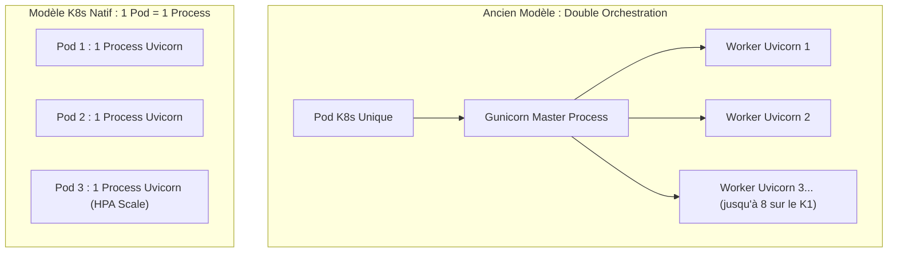

# FastAPI en Production Kubernetes : L'Anti-Pattern Gunicorn et le Modèle Cloud-Native avec UV

*Pendant de nombreuses années, le conteneur `tiangolo/uvicorn-gunicorn-fastapi` a été la référence pour déployer des applications FastAPI. Cependant, dans une architecture Kubernetes moderne, l'usage combiné de Gunicorn et Uvicorn crée un conflit direct d'orchestration. Analyse technique et guide de conception d'une image de production 100% Cloud-Native.*

---

## 🧐 L'Héritage : Pourquoi cette image a-t-elle été si populaire ?

Conçue par **Sebastián Ramírez** (le créateur de FastAPI), l'image `tiangolo/uvicorn-gunicorn-fastapi` associait deux briques complémentaires :
1. **Gunicorn** : Un gestionnaire de processus (*process manager*) robuste pour serveurs UNIX traditionnels.
2. **Uvicorn** : Un serveur ASGI asynchrone ultra-rapide capable de traiter les coroutines Python.

Dans un environnement de machine virtuelle (VM) classique ou un serveur VPS unique (sans orchestrateur), ce couple était parfait : Gunicorn démarrait un worker par cœur CPU et redémarrait automatiquement les processus qui plantaient.

---

## ⚠️ Le Constat Moderne : Pourquoi c'est un Anti-Pattern dans Kubernetes

Dès lors que vous déployez sur **Kubernetes**, cet agencement introduit une **double orchestration concurrente** :



### 1. Perte du contrôle de la scalabilité (Conflit avec le HPA)
- Gunicorn essaie de scaler verticalement **à l'intérieur du conteneur** en lançant `workers = CPU cores` (ex: 8 workers d'office sur notre serveur 8 vCPU).
- Kubernetes, lui, scale horizontalement **à l'extérieur** via le nombre de `replicas` de Pods avec le **Horizontal Pod Autoscaler (HPA)**.
- Deux cerveaux essaient d'orchestrer la montée en charge en même temps.

### 2. Explosion de la consommation mémoire
- Chaque worker Python charge en mémoire l'interpréteur, le framework et les bibliothèques.
- Un pod avec 8 workers Gunicorn consomme **entre 400 et 800 Mo de RAM dès le démarrage**, même à vide.
- En modèle K8s natif avec 1 seul worker, un Pod ne consomme que **~50 à 70 Mo de RAM**, permettant une densité et une efficience maximale.

### 3. Gestion des pannes et signaux POSIX
- Dans Kubernetes, la santé d'une application est surveillée par le **Kubelet** via les sondes `livenessProbe` et `readinessProbe`.
- Si Gunicorn masque le crash d'un worker ou retient les connexions, Kubernetes ne peut pas isoler correctement le trafic.
- À l'inverse, un Uvicorn en contact direct reçoit immédiatement les signaux `SIGTERM` envoyés lors des *rolling updates* pour exécuter un **graceful shutdown** propre.

---

## 🚀 Le Nouveau Standard : Dockerfile Multi-Stage avec UV

Pour respecter les standards Cloud-Native, nous combinons **le binaire ultra-rapide `uv` (Astral)** avec un **multi-stage build** dépouillé :

```dockerfile
# =============================================================================
# Stage 1: Builder (Avec toolchain de compilation C/C++)
# =============================================================================
FROM python:3.11-slim-bookworm AS builder

RUN apt-get update && apt-get install -y --no-install-recommends \
    gcc g++ libffi-dev libssl-dev pkg-config \
    && rm -rf /var/lib/apt/lists/*

# Binaire uv officiel
COPY --from=ghcr.io/astral-sh/uv:latest /uv /bin/uv
WORKDIR /app

COPY pyproject.toml README.md* requirements.txt* ./

# Installation déterministe avec pré-compilation du bytecode (.pyc)
RUN if [ -f pyproject.toml ]; then \
        uv sync --no-dev --compile-bytecode ; \
    elif [ -f requirements.txt ]; then \
        uv venv /app/.venv && uv pip install --no-cache -r requirements.txt ; \
    fi

# =============================================================================
# Stage 2: Runtime Minimal & Sécurisé (Zero compilateur)
# =============================================================================
FROM python:3.11-slim-bookworm AS runtime

RUN apt-get update && apt-get install -y --no-install-recommends \
    curl ca-certificates \
    && rm -rf /var/lib/apt/lists/*

WORKDIR /app

# Récupération de l'environnement virtuel pré-compilé
COPY --from=builder /app/.venv /app/.venv
COPY . /app

ENV PATH="/app/.venv/bin:$PATH" \
    PYTHONUNBUFFERED=1 \
    PYTHONDONTWRITEBYTECODE=1 \
    PORT=8000 \
    HOST=0.0.0.0

# Sécurité CIS Benchmark / Snyk : Utilisateur non-root obligatoire
RUN groupadd -g 10001 appgroup && \
    useradd -u 10001 -g appgroup -s /bin/sh -M appuser && \
    chown -R appuser:appgroup /app

USER 10001:10001
EXPOSE 8000

# 1 seul worker Uvicorn : la redondance est confiée à Kubernetes !
CMD ["uvicorn", "main:app", "--host", "0.0.0.0", "--port", "8000"]
```

---

## 🪤 Le Piège de la Migration : le Port change aussi

Remplacer l'image ne suffit pas. `tiangolo/uvicorn-gunicorn-fastapi` écoute sur le
**port 80** ; une image Uvicorn maison écoute typiquement sur **8000**. Si vous ne
changez que la ligne `image:`, le `Service` continue de router vers le 80, les sondes
échouent et le pod part en `CrashLoopBackOff` — un diagnostic pénible car l'erreur ne
vient pas de l'application.

Les quatre points à modifier ensemble :

```yaml
# deployment.yaml
ports:
  - containerPort: 8000        # au lieu de 80
readinessProbe:
  httpGet:
    path: /healthz             # un endpoint dédié, pas "/"
    port: 8000
---
# service.yaml
ports:
  - port: 80                   # inchangé -> l'Ingress n'est pas impacté
    targetPort: 8000           # route vers Uvicorn
```

Garder le `Service` sur le port 80 et ne déplacer que le `targetPort` évite de toucher
à l'`Ingress` et aux overlays Kustomize. Et puisque le `Dockerfile` crée un utilisateur
non privilégié, autant le déclarer côté pod pour que Kubernetes le refuse s'il dérive :

```yaml
securityContext:
  runAsNonRoot: true
  runAsUser: 10001
```

---

## 📊 Tableau Comparatif Synthétique

| Critère | Approche Gunicorn (Ancienne) | Approche K8s + UV (Moderne) |
| :--- | :--- | :--- |
| **Serveur d'application** | Gunicorn multi-workers + Uvicorn | **Uvicorn Standalone (1 worker)** |
| **Gestionnaire de dépendances** | `pip` (lent, sans lock strict) | **`uv` (10x à 100x plus rapide)** |
| **Bytecode Python** | Compilé à la volée au démarrage | **Pré-compilé (`--compile-bytecode`)** |
| **Empreinte mémoire par Pod** | 400 Mo - 800 Mo | **~50 Mo - 80 Mo** |
| **Sécurité d'exécution** | Souvent exécuté en `root` | **Utilisateur dédié non-privilégié (UID 10001)** |
| **Gestion du Scale** | Biaisée par le CPU de la machine | **100% pilotée par HPA et Pod Replicas** |

Ce modèle garantit un démarrage à froid quasi-instantané, une sécurité renforcée et une intégration parfaite dans les pipelines GitOps et Kubernetes.
