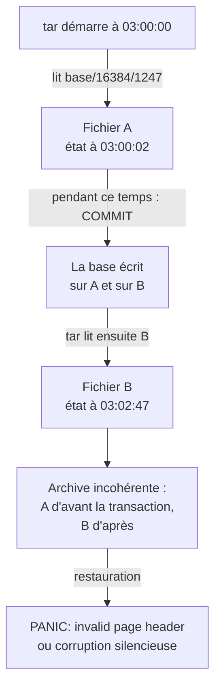
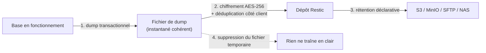

# Sauvegardes : Pourquoi Copier le Volume d'une Base de Données Produit une Archive Corrompue

*C'est le scénario classique de l'auto-hébergement : un `docker compose` propre, des volumes nommés, et une tâche planifiée qui archive `/var/lib/docker/volumes` toutes les nuits. Tout semble en ordre — jusqu'au jour où l'on tente une restauration et où PostgreSQL refuse de démarrer. Explication du mécanisme, et du pattern qui le résout.*

---

## 💥 Le Problème : la Sauvegarde Non Cohérente

Prenons la tâche de sauvegarde la plus répandue :

```bash
# Ce que presque tout le monde fait au début
tar czf backup-$(date +%F).tar.gz /var/lib/docker/volumes/postgres-data
```

Elle s'exécute sans erreur. L'archive fait la bonne taille. Elle est illisible une fois sur trois.

### Ce qui se passe réellement

Une base de données en fonctionnement ne garde pas ses fichiers dans un état cohérent en permanence. À tout instant, PostgreSQL manipule au moins trois choses désynchronisées : des pages modifiées encore en mémoire (*shared buffers*), un journal d'écriture anticipée (*WAL*) en avance sur les fichiers de données, et des transactions en cours à moitié écrites.

`tar` parcourt l'arborescence fichier par fichier, et cela prend du temps — parfois plusieurs minutes. Pendant ce parcours, la base continue d'écrire :



L'archive contient un mélange de deux instants différents. Elle ne correspond à aucun état ayant réellement existé. PostgreSQL le détecte au démarrage et refuse de se lancer — ou pire, démarre et sert des données subtilement incohérentes.

> **Le piège aggravant** : ce problème n'est pas déterministe. Si la base est peu sollicitée au moment du `tar`, l'archive est cohérente par chance et se restaure parfaitement. On teste une fois, ça marche, on conclut que la procédure est bonne. L'échec surgit le jour où l'on restaure vraiment — c'est-à-dire le pire jour possible.

---

## ✅ Le Pattern : Dump Logique, puis Ingestion dans Restic

La solution consiste à ne jamais sauvegarder les fichiers de la base, mais à lui demander de produire elle-même une **représentation cohérente** de son contenu, puis à archiver ce résultat.



Chaque moteur fournit sa commande de cohérence :

| Moteur | Commande | Ce qu'elle garantit |
| :--- | :--- | :--- |
| **PostgreSQL** | `pg_dump --format=custom` | Instantané transactionnel via MVCC |
| **MySQL / MariaDB** | `mysqldump --single-transaction` | Transaction unique en isolation REPEATABLE READ |
| **SQLite** | `sqlite3 ".backup"` | Copie à chaud gérée par le moteur |
| **MongoDB** | `mongodump --oplog` | Dump + rejeu de l'oplog |

Deux options méritent une attention particulière, car les omettre reproduit exactement le problème qu'on cherche à éviter :

- **`--single-transaction` (MySQL)** : sans elle, `mysqldump` lit les tables les unes après les autres, sans cohérence entre elles. Avec elle, l'ensemble du dump est pris dans une seule transaction. Attention : cela ne fonctionne qu'avec des moteurs transactionnels — **InnoDB oui, MyISAM non**.
- **`--format=custom` (PostgreSQL)** : produit un format compressé qui permet la restauration sélective et le parallélisme (`pg_restore -j`), là où le SQL brut impose un rejeu séquentiel intégral.

### Implémentation de référence

```bash
#!/usr/bin/env bash
set -euo pipefail

ENGINE="${1:-postgresql}"
DATABASE="${2:-app_db}"
OUTPUT="/tmp/backups/${DATABASE}_$(date +%Y%m%d_%H%M%S)"
RESTIC_REPOSITORY="${RESTIC_REPOSITORY:?variable requise}"

mkdir -p /tmp/backups
# Le dump transite par un fichier temporaire : on le supprime quoi qu'il arrive.
trap 'rm -f "${DUMP_FILE:-}"' EXIT

# 1. Dump cohérent
case "$ENGINE" in
  postgresql)
    pg_dump --format=custom "$DATABASE" > "${OUTPUT}.dump"
    DUMP_FILE="${OUTPUT}.dump"
    ;;
  mysql|mariadb)
    mysqldump --single-transaction --quick "$DATABASE" > "${OUTPUT}.sql"
    DUMP_FILE="${OUTPUT}.sql"
    ;;
  sqlite)
    sqlite3 "$DATABASE" ".backup '${OUTPUT}.sqlite'"
    DUMP_FILE="${OUTPUT}.sqlite"
    ;;
  *)
    echo "Moteur non supporté : $ENGINE" >&2
    exit 1
    ;;
esac

# 2. Ingestion : chiffrement et déduplication ont lieu côté client
restic backup "$DUMP_FILE" --tag "db,${ENGINE},${DATABASE}"

# 3. Rétention
restic forget --keep-daily 7 --keep-weekly 4 --keep-monthly 12 --prune
```

Le `trap ... EXIT` n'est pas décoratif : sans lui, un échec de `restic` laisse un dump **en clair** dans `/tmp`, contenant l'intégralité de la base. C'est une fuite de données silencieuse, sur un chemin souvent lisible par tous les utilisateurs de la machine.

### Pourquoi Restic plutôt qu'une archive `tar`

- **Chiffrement côté client** (AES-256 + Poly1305) : la donnée est chiffrée **avant** de quitter le serveur. Le fournisseur de stockage ne peut rien lire — ce qui rend acceptable l'usage d'un stockage tiers bon marché.
- **Déduplication au niveau des blocs** : deux dumps quotidiens consécutifs d'une base peu modifiée ne transfèrent que le delta. En pratique, on stocke des mois d'historique pour le coût de quelques instantanés.
- **Rétention déclarative** : `forget --keep-daily 7 --keep-weekly 4 --keep-monthly 12` exprime une politique, là où une rotation maison en Bash est un nid à bugs.
- **Support Rclone** : `rclone:remote:chemin` ouvre plus de quarante destinations (Backblaze B2, S3, SFTP, Drive…) sans changer le script.

---

## 🧭 Choisir son Outil : Matrice de Décision

Le pattern dump + Restic couvre l'essentiel des besoins d'auto-hébergement. Il n'est pas universel pour autant.

| Besoin opérationnel | Solution | Pourquoi |
| :--- | :--- | :--- |
| **Automatisation DevOps, GitOps** | Scripts natifs + **Restic** | Auditabilité totale, aucune interface à maintenir, s'intègre en CronJob Kubernetes |
| **Interface web prête à l'emploi** | **Databasement** ou **Backrest** | Tableau de bord, planification et navigation dans les instantanés sans CLI |
| **Administration graphique complète** | **Kopia** | GUI web native, gestion fine des politiques de rétention |
| **Sauvegarde système Linux complète** | **Borg** + **Borgmatic** | Excellente compression, hooks de dump PostgreSQL/MySQL intégrés |
| **PostgreSQL critique** | **pgBackRest** | Streaming WAL, **restauration à un instant précis (PITR)**, restauration delta parallélisée |
| **MySQL volumineux** | **Percona XtraBackup** | Sauvegarde physique à chaud non bloquante sur plusieurs dizaines de Go |

### Le critère qui tranche vraiment : RPO et volumétrie

Le pattern dump + Restic a une limite structurelle : **on ne peut restaurer qu'aux instants où un dump a été pris**. Avec une tâche nocturne, la perte maximale de données (RPO) est de 24 heures.

Si cela est inacceptable, aucun réglage de Restic n'y changera quoi que ce soit — il faut changer de catégorie d'outil. `pgBackRest` archive le flux WAL en continu et permet de restaurer à la seconde près, y compris juste avant un `DROP TABLE` accidentel. C'est le seul moyen d'atteindre un RPO de quelques minutes.

Le second seuil est la volumétrie. Au-delà de quelques dizaines de gigaoctets, `pg_dump` devient long et `pg_restore` encore davantage : une restauration logique rejoue les données **et reconstruit tous les index**. Les sauvegardes physiques (pgBackRest, XtraBackup) restaurent des fichiers déjà indexés, dans un temps sans commune mesure.

> Formulé autrement : le dump logique optimise la **simplicité et la portabilité**, la sauvegarde physique optimise le **temps de restauration**. Pour un homelab ou une base de quelques gigaoctets, le premier est le bon choix. Pour de la production critique, le second n'est pas négociable.

---

## 🧪 Une Sauvegarde Non Testée n'est Pas une Sauvegarde

C'est la règle la plus citée et la moins appliquée. Le pattern décrit plus haut ne vaut rien si personne ne vérifie qu'il produit des archives restaurables.

Deux niveaux de vérification, de coût très différent :

```bash
# Niveau 1 — intégrité du dépôt (rapide, quotidien)
restic check

# Niveau 2 — intégrité réelle des données (lent, mensuel)
# --read-data-subset relit et vérifie 5 % des blocs, choisis au hasard
restic check --read-data-subset=5%
```

`restic check` seul ne valide que les métadonnées et la structure. Il ne relit pas le contenu. Un dépôt peut passer `check` alors que des blocs ont silencieusement pourri sur le disque — c'est précisément ce que `--read-data-subset` détecte.

Mais la seule vérification qui prouve quelque chose reste la **restauration réelle** :

```bash
# Restauration du dernier instantané dans un répertoire jetable
restic restore latest --target /tmp/test-restore --tag db,postgresql

# Rejeu dans un conteneur éphémère
docker run --rm -d --name pg-verif -e POSTGRES_PASSWORD=verif postgres:16-alpine
pg_restore -h localhost -U postgres -d postgres /tmp/test-restore/…/app_db.dump
psql -h localhost -U postgres -c "SELECT count(*) FROM ma_table_temoin;"
```

Automatiser ce cycle une fois par mois — restaurer, compter des lignes sur une table témoin, détruire — transforme une supposition en garantie. C'est aussi le seul test qui détecte les erreurs de procédure : mot de passe de dépôt perdu, permissions insuffisantes, extension PostgreSQL absente de l'image de restauration.

---

## 🎯 Synthèse

| Pratique | Verdict |
| :--- | :--- |
| `tar` sur le volume d'une base en fonctionnement | **Archive incohérente**, échec non déterministe |
| Arrêter le conteneur, puis `tar` | Cohérent, mais impose une interruption de service |
| Dump logique → Restic | **Cible pour l'auto-hébergement** : cohérent, chiffré, dédupliqué |
| Dump laissé en clair dans `/tmp` | Fuite silencieuse — imposer un `trap` de nettoyage |
| `restic check` seul | Valide la structure, **pas** les données |
| Restauration testée dans un conteneur jetable | La seule preuve réelle |

La bascule mentale à opérer est simple : on ne sauvegarde pas *les fichiers* d'une base de données, on sauvegarde *ce que la base accepte d'exporter de façon cohérente*. Tout le reste — chiffrement, déduplication, rétention, destination — n'est que de la plomberie que Restic gère déjà.

Reste la question de la protection du dépôt lui-même : les identifiants S3 et la phrase de passe Restic sont, par construction, les secrets les plus sensibles de l'infrastructure. Ils méritent le traitement décrit dans l'article consacré à [la gestion des secrets](/fr/blog/secrets-en-clair-git-detection-purge-prevention/) — un dépôt de sauvegardes dont la clé fuite n'est plus une sauvegarde, c'est une exfiltration.
