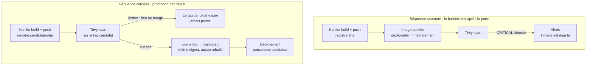

# Entre le Build et le Push : Scanner Vraiment, et Pas Pour la Forme

*Ajouter Trivy à un pipeline prend cinq minutes. Faire en sorte que ce Trivy empêche réellement une image vulnérable d'atteindre la production demande de revoir l'ordre des étapes — et d'accepter que le pipeline puisse échouer. Deux défauts très répandus transforment une chaîne DevSecOps en théâtre de sécurité.*

---

## 🎭 Défaut n°1 : Le Scan Après le Push

Voici la structure du pipeline que l'on rencontre presque partout :

```yaml
build:
  stage: build
  script:
    - /kaniko/executor
        --context "${CI_PROJECT_DIR}"
        --destination "${CI_REGISTRY_IMAGE}:${CI_COMMIT_SHORT_SHA}"   # ← push immédiat

trivy-scan:
  stage: security        # ← s'exécute APRÈS
  needs: ["build"]
  script:
    - trivy image --severity HIGH,CRITICAL ${CI_REGISTRY_IMAGE}:${CI_COMMIT_SHORT_SHA}
```

La séquence est logique en apparence : on construit, puis on vérifie. Sauf que Kaniko pousse l'image **dans le cadre même de l'étape de build**. Quand Trivy s'exécute, l'image vulnérable est déjà publiée dans le registre, référençable et déployable.

Concrètement, entre le `build` et la fin du `trivy-scan` :

- un `kubectl set image` manuel peut tirer l'image ;
- une politique `imagePullPolicy: Always` sur un pod qui redémarre la récupère ;
- un opérateur de mise à jour automatique type Watchtower ou Renovate peut la proposer ;
- si le tag est `latest`, tout déploiement de la fenêtre la consomme.

Le scan ne fonctionne pas comme une barrière, mais comme une alarme qui sonne une fois la porte franchie.



### La correction : un tag candidat, puis une promotion

On ne peut pas scanner une image sans l'avoir construite, et Kaniko n'a pas d'option « construire sans pousser » exploitable en cluster. La réponse n'est donc pas d'éviter le push, mais de **dissocier le push de la publication**.

Kaniko pousse sur un tag de quarantaine que rien ne déploie. Si le scan passe, [Crane](/fr/blog/build-images-kubernetes-kaniko-crane/) promeut l'image en posant un nouveau tag sur le **même digest** — sans retélécharger ni reconstruire quoi que ce soit :

```yaml
build:
  stage: build
  script:
    - /kaniko/executor
        --context "${CI_PROJECT_DIR}"
        --destination "${CI_REGISTRY_IMAGE}:candidate-${CI_COMMIT_SHORT_SHA}"

trivy-scan:
  stage: security
  needs: ["build"]
  script:
    # Pas de allow_failure : un CRITICAL arrête le pipeline
    - trivy image --exit-code 1 --severity CRITICAL --ignore-unfixed
        "${CI_REGISTRY_IMAGE}:candidate-${CI_COMMIT_SHORT_SHA}"

promote:
  stage: promote
  needs: ["trivy-scan"]
  script:
    - crane tag "${CI_REGISTRY_IMAGE}:candidate-${CI_COMMIT_SHORT_SHA}" "validated-${CI_COMMIT_SHORT_SHA}"
```

Les déploiements ne référencent que le préfixe `validated-`. Une image qui échoue au scan reste dans le registre sous son tag candidat, inerte, et sera nettoyée par la politique de rétention.

> **Pourquoi la promotion par digest change tout** : `crane tag` crée un pointeur sur un manifeste OCI existant. L'opération dure quelques centaines de millisecondes et ne transfère aucune couche. L'artefact déployé est **bit pour bit** celui qui a été scanné — garantie que ne donne aucun pipeline qui reconstruit l'image entre la validation et la production.

---

## 🎭 Défaut n°2 : Les Barrières Qui Ne Barrent Rien

Le second défaut est plus insidieux, car il produit des pipelines verts et des tableaux de bord rassurants.

```yaml
trivy-scan:
  script:
    - trivy image --severity HIGH,CRITICAL ${IMAGE}
  allow_failure: true          # ← le job peut échouer sans conséquence

deps-scan:
  script:
    - safety check --json > safety-report.json || true    # ← l'erreur est avalée
    - pip-audit --format json > pip-audit-report.json || true
    - bandit -r . -f json -o bandit-report.json || true
```

Trois mécanismes neutralisent ici la détection :

1. **`allow_failure: true`** — le job apparaît en échec dans l'interface, mais le pipeline continue et le déploiement suit.
2. **`|| true`** — le code de retour est écrasé ; le shell ne voit jamais l'échec.
3. **Absence de `--exit-code`** — par défaut, `trivy image` affiche ses résultats et **sort avec le code 0**, même en trouvant des vulnérabilités critiques. Sans `--exit-code 1`, le job est vert quoi qu'il arrive.

Ces trois motifs n'apparaissent pas par négligence. Ils sont ajoutés le jour où le scan bloque le pipeline pour une CVE sans correctif disponible, et où il faut livrer. Le problème n'est pas l'intention, c'est que le contournement devient permanent.

### Le réglage qui rend le blocage soutenable

Un scan n'est tenable dans la durée que s'il ne remonte **que des choses actionnables**. Trois options y suffisent :

```bash
trivy image \
  --exit-code 1 \          # échouer réellement
  --severity CRITICAL \    # ne bloquer que sur CRITICAL, pas HIGH
  --ignore-unfixed \       # ignorer ce qu'aucun correctif ne résout
  "${IMAGE}"
```

- **`--ignore-unfixed`** est la plus importante. Une CVE sans correctif publié n'appelle aucune action de votre part : la signaler bloque le pipeline sans offrir de solution. C'est la première cause d'ajout de `allow_failure`.
- **`--severity CRITICAL`** en bloquant, **`HIGH` en informatif**. Bloquer sur `HIGH` génère un volume qui conduit inévitablement à désarmer la barrière.

D'où un découpage en deux jobs, l'un bloquant et minimaliste, l'autre exhaustif et informatif :

```yaml
trivy-gate:            # bloquant, volume faible
  script:
    - trivy image --exit-code 1 --severity CRITICAL --ignore-unfixed "${IMAGE}"

trivy-report:          # informatif, vision complète
  script:
    - trivy image --severity HIGH,CRITICAL --format json --output trivy.json "${IMAGE}"
  allow_failure: true
  artifacts:
    paths: ["trivy.json"]
```

Et pour les exceptions assumées, un fichier `.trivyignore` versionné — qui laisse une trace revue en *code review*, contrairement à un `allow_failure` global :

```
# CVE-2023-12345 : non exploitable, le composant n'est pas appelé (revu 2026-09-20)
CVE-2023-12345
```

---

## 🧰 Quatre Scans, Quatre Objets Distincts

« Scanner » recouvre des vérifications qui ne cherchent pas la même chose, ne s'exécutent pas au même moment et n'ont pas le même coût.

| Outil | Ce qu'il inspecte | Quand | Bloquant ? |
| :--- | :--- | :--- | :---: |
| **Hadolint** | Le `Dockerfile` (bonnes pratiques) | Avant le build | Oui — instantané |
| **TruffleHog** | L'historique Git (secrets) | En parallèle du build | **Oui — toujours** |
| **Semgrep / Bandit** | Le code source (SAST) | En parallèle du build | Sur règles critiques |
| **Trivy** | L'image produite (CVE, OS + dépendances) | Après le build, avant promotion | Oui, sur `CRITICAL` |

Deux points méritent d'être soulignés.

**TruffleHog n'a pas besoin de l'image.** Il analyse le dépôt Git, donc il peut tourner avec `needs: []`, dès la première seconde du pipeline, en parallèle du build. Un secret détecté doit interrompre immédiatement : inutile de construire une image dont le code contient déjà une clé exposée. C'est aussi le seul scan pour lequel je recommande un blocage sans nuance — une fuite d'identifiant ne se négocie pas.

```yaml
secrets-scan:
  stage: security
  needs: []                        # démarre immédiatement
  image: trufflesecurity/trufflehog:latest
  script:
    - trufflehog git file://. --only-verified --fail
```

L'option `--only-verified` mérite là encore d'être précisée : TruffleHog tente d'authentifier chaque secret candidat auprès du service concerné. Sans elle, un dépôt un peu ancien produit des centaines de faux positifs et le job finit désarmé. Avec elle, on ne remonte que des identifiants **encore actifs** — c'est-à-dire exactement ce qui justifie d'arrêter le pipeline.

**Hadolint coûte deux secondes** et se place avant tout le reste. Il attrape en amont ce que Trivy signalerait ensuite en aval : image de base non épinglée, exécution en `root`, caches `apt` laissés dans les couches. Corriger un `Dockerfile` coûte infiniment moins cher que de trier des CVE dans l'image résultante.

---

## 🔗 Le Pipeline Complet

```yaml
stages: [lint, build, security, promote, deploy]

dockerfile-lint:
  stage: lint
  image: hadolint/hadolint:latest-debian
  script: ["hadolint Dockerfile"]

build:
  stage: build
  image:
    name: gcr.io/kaniko-project/executor:v1.14.0-debug
    entrypoint: [""]
  script:
    - /kaniko/executor
        --context "${CI_PROJECT_DIR}"
        --destination "${CI_REGISTRY_IMAGE}:candidate-${CI_COMMIT_SHORT_SHA}"
        --cache=true
        --cache-repo="${CI_REGISTRY_IMAGE}/cache"

secrets-scan:
  stage: security
  needs: []
  image: trufflesecurity/trufflehog:latest
  script: ["trufflehog git file://. --only-verified --fail"]

sast-scan:
  stage: security
  needs: []
  image: returntocorp/semgrep
  script: ["semgrep --config=auto --error ."]

trivy-gate:
  stage: security
  needs: ["build"]
  image: { name: aquasec/trivy:latest, entrypoint: [""] }
  script:
    - trivy image --exit-code 1 --severity CRITICAL --ignore-unfixed
        "${CI_REGISTRY_IMAGE}:candidate-${CI_COMMIT_SHORT_SHA}"

promote:
  stage: promote
  needs: ["trivy-gate", "secrets-scan", "sast-scan"]
  script:
    - crane tag "${CI_REGISTRY_IMAGE}:candidate-${CI_COMMIT_SHORT_SHA}" "validated-${CI_COMMIT_SHORT_SHA}"

deploy:
  stage: deploy
  needs: ["promote"]
  script:
    - kubectl set image deployment/api api="${CI_REGISTRY_IMAGE}:validated-${CI_COMMIT_SHORT_SHA}"
```

Trois propriétés structurent cette chaîne :

- **Les scans indépendants du build démarrent immédiatement** (`needs: []`). Un secret dans le code fait échouer le pipeline avant même la fin de la construction.
- **Aucun tag déployable n'existe avant `promote`.** La quarantaine est une propriété du nommage, pas une convention orale.
- **`deploy` référence le tag validé**, et il désigne le digest scanné. Rien n'a été reconstruit entre les deux.

---

## 🎯 Synthèse

| Pratique | Effet réel |
| :--- | :--- |
| Scanner après un push sur le tag final | L'image vulnérable est déployable pendant le scan |
| `allow_failure: true` sur le job de scan | La barrière est décorative |
| `trivy image` sans `--exit-code 1` | **Job vert même avec des CVE critiques** |
| Bloquer sur `HIGH` + `CRITICAL` sans `--ignore-unfixed` | Volume ingérable → désarmement à court terme |
| Tag candidat → scan → `crane tag` | L'artefact déployé est celui qui a été validé |
| `.trivyignore` commenté et versionné | Exceptions tracées et revues, plutôt que contournement global |

Un pipeline DevSecOps ne se juge pas au nombre d'outils qu'il invoque, mais à une question unique : **existe-t-il un moment où une image non validée est déployable ?** Si oui, l'ordre des étapes est à revoir avant d'ajouter le moindre scanner supplémentaire.
