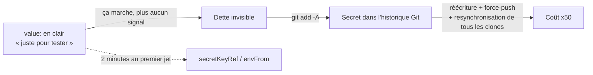

# Six Secrets en Clair dans Mes Propres Manifestes : Détection, Purge et Prévention

*Il est confortable d'écrire sur la gestion des secrets en se plaçant du côté de celui qui sait. C'est moins confortable — et nettement plus utile — de le faire après avoir trouvé six identifiants en clair dans ses propres manifestes Kubernetes. Voici ce que l'audit a révélé, pourquoi cela arrive même quand on connaît la règle, et comment réparer sans se tromper d'outil.*

---

## 🔍 Ce que l'audit a trouvé

Le déclencheur était anodin : relire des manifestes Kubernetes avant de les committer. Une recherche de trois secondes :

```bash
grep -rn 'value: "' --include="*.yaml" kubernetes/ | grep -iE 'password|secret|token'
```

Six résultats, répartis sur trois fichiers :

| Fichier | Variable | Nature |
| :--- | :--- | :--- |
| `databases/postgres.yaml` | `POSTGRES_PASSWORD` | Mot de passe maître PostgreSQL |
| `databases/couchdb.yaml` | `COUCHDB_PASSWORD` | Mot de passe administrateur |
| `databases/couchdb.yaml` | `COUCHDB_SECRET` | Clé de signature des cookies |
| `monitoring/umami.yaml` | `POSTGRES_PASSWORD` | Mot de passe de la base Umami |
| `monitoring/umami.yaml` | `DATABASE_URL` | URI complète, **identifiants inclus** |
| `monitoring/umami.yaml` | `APP_SECRET` | Clé de session applicative |

Le détail qui compte : ces fichiers n'étaient **pas encore suivis par Git**. Un seul `git add -A` les gravait définitivement. L'audit a été fait du bon côté de la ligne — par chance, pas par méthode.

Plus instructif encore : dans le **même dépôt**, le manifeste d'Infisical faisait les choses correctement depuis le début :

```yaml
envFrom:
  - secretRef:
      name: infisical-secrets
```

Le savoir-faire était donc présent. Ce n'est pas un problème de connaissance.

---

## 🧠 Pourquoi cela arrive, même en sachant

Le motif est toujours le même. On écrit un manifeste pour valider qu'un service démarre. Mettre la valeur en dur fait gagner trente secondes et évite de créer un Secret avant même de savoir si la stack tient debout. On se promet de revenir dessus.

Deux mécanismes font que l'on ne revient pas :

1. **Le manifeste fonctionne.** Rien ne le signale plus jamais. Un `value:` en clair ne produit ni avertissement, ni échec de démarrage, ni ligne dans les logs. Il n'existe aucun moment naturel où le système vous rappelle la dette.
2. **Le coût de réparation est asymétrique.** Écrire `secretKeyRef` au premier jet coûte deux minutes. Le faire après cinquante commits coûte une réécriture d'historique, un `force-push`, et une resynchronisation de tous les clones existants.



La conclusion pratique n'est pas « soyez vigilant » — cela ne marche pas. C'est : **écrire `valueFrom.secretKeyRef` dès la première version du manifeste**, avant même que le service ne démarre. Le brouillon est le seul moment où c'est gratuit.

---

## 🕵️ Étape 1 — Diagnostic : savoir ce qui est déjà exposé

Avant toute chose, il faut distinguer deux situations radicalement différentes : le secret est dans le *répertoire de travail* (facile) ou dans l'*historique* (difficile).

### Chercher dans l'historique

`git log -S` recherche les commits où une chaîne apparaît ou disparaît :

```bash
# Un secret précis, dans toute l'histoire
git log -S "le-mot-de-passe-suspect" --oneline

# Tous les fichiers ayant existé sous un dossier sensible
git log --all --full-history --name-only -- ".secrets/" | sort -u
```

### Scanner automatiquement

Chercher à la main ne trouve que ce qu'on soupçonne déjà. Un scanner détecte les formats connus — clés AWS, tokens GitHub, clés privées, chaînes de connexion :

```bash
# TruffleHog : --only-verified ne remonte que les secrets encore actifs
trufflehog git file://. --only-verified

# Gitleaks, alternative plus rapide sur les gros dépôts
gitleaks detect --source . --report-format json
```

L'option `--only-verified` mérite un commentaire : TruffleHog tente d'authentifier les secrets trouvés auprès du service concerné. Elle transforme une liste de milliers de faux positifs en une liste courte de fuites réelles à traiter en priorité. C'est la différence entre un rapport qu'on lit et un rapport qu'on ignore.

---

## 🧹 Étape 2 — Purger l'historique

Supprimer le secret dans un nouveau commit **ne suffit pas**. Git conserve l'intégralité des révisions : le secret reste accessible à quiconque possède le dépôt, via `git show` sur l'ancien commit.

### Sauvegarder avant tout

La réécriture d'historique est destructive et non réversible. Systématiquement, sans exception :

```bash
git branch backup-avant-purge
git clone --mirror file://. ../mon-depot-backup.git
```

### Réécrire

L'outil recommandé aujourd'hui est **`git-filter-repo`**, qui remplace `git filter-branch` — ce dernier étant lent, truffé de pièges et officiellement déconseillé par Git lui-même :

```bash
# Remplacer des chaînes dans toute l'histoire
# expressions.txt contient une ligne par motif : literal:mon-secret==>[REDACTED]
git filter-repo --replace-text expressions.txt

# Ou supprimer un fichier entier de toute l'histoire
git filter-repo --path .secrets/config.env --invert-paths
```

> **Le piège du fichier de motifs.** Ce fichier `expressions.txt` contient, par construction, la liste exacte de tous vos secrets en clair. Il constitue un inventaire parfait pour un attaquant. Il ne doit jamais être committé, jamais laissé dans le dépôt, et doit être détruit dès l'opération terminée. L'erreur est facile à commettre : on documente sa procédure de purge, on y colle la table de remplacement pour la postérité, et le commit de documentation réintroduit dans l'historique exactement ce que la purge venait d'en retirer. Documentez la **méthode**, jamais les **valeurs**.

### Purger les objets orphelins

C'est l'étape que l'on oublie le plus souvent, et elle annule tout le reste. La réécriture laisse des références de sauvegarde ; tant qu'elles existent, les anciens objets — donc les secrets — restent dans la base locale :

```bash
# Supprimer les références de sauvegarde laissées par la réécriture
git update-ref -d refs/original/refs/heads/main
rm -rf .git/refs/original/

# Expirer le reflog, puis collecter réellement les objets devenus orphelins
git reflog expire --expire=now --all
git gc --prune=now --aggressive
```

Vérifiez ensuite que la chaîne a bien disparu — `git log -S` doit ne rien renvoyer :

```bash
git log -S "le-mot-de-passe-suspect" --oneline   # doit être vide
```

### Propager

```bash
git push origin main --force
```

> ⚠️ Le `--force` réécrit l'historique distant. Tous les clones existants deviennent incompatibles et devront être refaits ou remis à niveau par `git reset --hard origin/main`. Prévenez avant, pas après.

---

## 🔐 Étape 3 — Considérer les secrets comme compromis

Voici le point que les tutoriels de purge passent sous silence, et c'est le plus important.

**Une purge réussie ne dé-compromet rien.** Si le dépôt a été poussé, ne serait-ce qu'une minute, sur une forge publique, supposez que les secrets ont été collectés. Les robots de scraping surveillent le flux d'événements de GitHub en temps réel ; le délai entre un push et la première tentative d'exploitation d'une clé cloud se mesure en secondes, pas en heures.

Par ailleurs, une purge locale ne supprime ni les forks, ni les caches de la forge, ni les *pull requests* ouvertes, ni les sauvegardes de CI.

L'ordre des opérations est donc contre-intuitif :

1. **Révoquer et faire tourner les secrets** — en premier, immédiatement.
2. **Purger l'historique** — ensuite, pour limiter la traîne.

Inverser les deux revient à passer des heures sur une réécriture pendant que la clé compromise reste valide.

---

## 🛡️ Étape 4 — Prévenir

### Côté Kubernetes

Jamais de `value:` pour une donnée sensible. Deux formes selon le besoin :

```yaml
# Une variable isolée
env:
  - name: POSTGRES_PASSWORD
    valueFrom:
      secretKeyRef:
        name: postgres-secrets
        key: POSTGRES_PASSWORD

# Tout un jeu de variables
envFrom:
  - secretRef:
      name: infisical-secrets
```

Le Secret lui-même se crée hors dépôt, depuis un fichier local ignoré par Git :

```bash
kubectl create secret generic postgres-secrets \
  --from-env-file=.secrets/postgres.env -n databases
```

> Rappel utile : un Secret Kubernetes est encodé en **base64, pas chiffré**. Il protège contre la lecture accidentelle, pas contre un accès à `etcd` ou contre des droits RBAC trop larges. Pour aller plus loin, il faut du chiffrement au repos, ou un gestionnaire externe — c'est le rôle que [remplit Infisical dans notre cluster](/fr/blog/cluster-k3s-rancher-infisical-valkey-faster-whisper/).

### Côté dépôt

Un `.gitignore` qui laisse passer la documentation mais bloque les valeurs :

```gitignore
.secrets/*
!.secrets/*.md
*.pem
*.key
*.csv
```

### Côté automatisation

C'est la seule barrière qui ne dépend pas de la vigilance. Un *hook* de pré-commit refuse le commit avant qu'il n'existe :

```yaml
# .pre-commit-config.yaml
repos:
  - repo: https://github.com/gitleaks/gitleaks
    rev: v8.21.2
    hooks:
      - id: gitleaks
```

Et en CI, un filet de sécurité pour ce qui passerait quand même :

```yaml
secrets-scan:
  image: trufflesecurity/trufflehog:latest
  script:
    - trufflehog git file://. --only-verified --fail
```

---

## 🎯 Ce que je retiens

| Constat | Conséquence pratique |
| :--- | :--- |
| Savoir ne suffit pas — le bon pattern existait dans le même dépôt | La prévention doit être **automatique**, pas disciplinaire |
| Un `value:` en clair n'émet jamais aucun signal | Ajouter un scan en pré-commit, seul moment où un signal apparaît |
| Le coût de réparation est cinquante fois celui de la prévention | Écrire `secretKeyRef` dès le brouillon, avant le premier démarrage |
| La table de remplacement d'une purge est un inventaire de secrets | Documenter la méthode, jamais les valeurs |
| Purger n'est pas révoquer | Faire tourner les secrets **avant** de réécrire l'historique |

L'audit qui a déclenché cet article a pris trois secondes et une commande `grep`. Le durcissement a pris une heure. Si les fichiers avaient été committés une semaine plus tôt, il aurait fallu compter en jours — et une rotation d'identifiants sur l'ensemble des services concernés. C'est tout l'écart entre relire ses manifestes avant de les committer, et les relire après.
