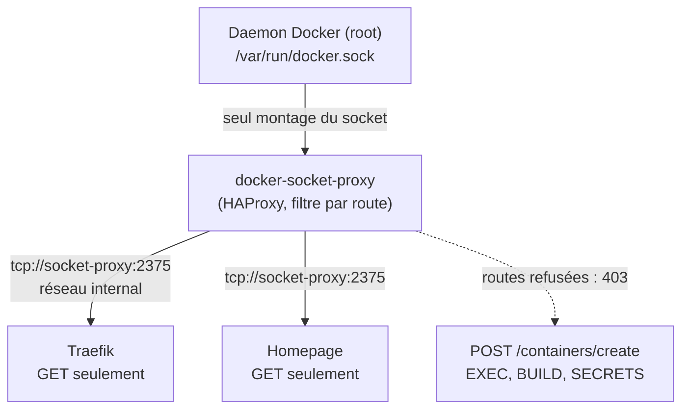

# Le Socket Docker : Pourquoi Votre Montage `:ro` Ne Protège de Rien

*Traefik, Portainer, Watchtower, Homepage, les runners de CI : une bonne partie de l'écosystème Docker réclame l'accès au socket du daemon. Le réflexe consiste à le monter en lecture seule et à passer à autre chose. Ce réflexe ne protège de rien, et comprendre pourquoi change la façon dont on conçoit une stack auto-hébergée.*

---

## 🎭 L'Illusion du `:ro`

Voici la ligne que l'on retrouve dans des milliers de `docker-compose.yml` :

```yaml
volumes:
  - /var/run/docker.sock:/var/run/docker.sock:ro
```

Le suffixe `:ro` rassure. Il ne devrait pas.

`/var/run/docker.sock` n'est pas un fichier de configuration : c'est une **socket UNIX**, c'est-à-dire un point d'entrée d'API. Le drapeau `:ro` s'applique au descripteur de fichier — il empêche d'écraser la socket elle-même. Il n'a **aucun effet sur les requêtes qui la traversent**, parce qu'un appel d'API se fait par écriture sur la socket, pas par modification du fichier.

Autrement dit : monter le socket en `:ro`, c'est verrouiller la boîte aux lettres tout en continuant à y poster ce qu'on veut.

### Ce qu'un conteneur peut faire avec ce montage

L'API Docker expose la création de conteneurs. Rien n'empêche un processus disposant du socket de demander au daemon — qui tourne en root sur l'hôte — de démarrer un conteneur privilégié montant la racine du système de fichiers :

```bash
# Depuis l'intérieur d'un conteneur disposant du socket monté en ":ro"
curl -s --unix-socket /var/run/docker.sock \
  -H "Content-Type: application/json" \
  -X POST "http://localhost/containers/create" \
  -d '{
        "Image": "alpine",
        "Cmd": ["chroot", "/hostroot", "sh"],
        "HostConfig": { "Binds": ["/:/hostroot"], "Privileged": true }
      }'
```

Le conteneur créé n'est plus soumis aux restrictions du premier. Il voit l'intégralité du disque hôte en écriture. À partir de là, ajouter une clé SSH dans `/hostroot/root/.ssh/authorized_keys` ou déposer une unité systemd est une formalité.

> **La règle à retenir** : donner accès au socket Docker équivaut à donner un shell root sur l'hôte. Le `:ro` ne change strictement rien à cette équivalence. C'est une permission d'administration, pas un volume de données.

Cette réalité est aussi le point de départ de [Kaniko et des builds rootless en cluster](/fr/blog/build-images-kubernetes-kaniko-crane/) : si construire une image impose de monter le socket dans le pod de CI, alors la chaîne de build entière hérite d'un accès root à ses nœuds.

---

## 🧱 La Réponse : Interposer un Proxy de Socket

Puisqu'on ne peut pas restreindre l'API par le montage, il faut la restreindre **par filtrage**. C'est le rôle de `docker-socket-proxy` (Tecnativa) : un conteneur minimal basé sur HAProxy, seul à monter le socket, qui réexpose l'API sur un port TCP en n'autorisant que les routes explicitement activées.



Trois propriétés font la sécurité du montage, et elles comptent toutes les trois :

1. **Un seul conteneur monte le socket** — le proxy. Aucun autre service n'y a accès.
2. **Le réseau est `internal: true`** — le port 2375 n'est joignable que depuis les conteneurs explicitement rattachés à ce réseau, jamais depuis l'hôte ni depuis l'extérieur. C'est capital : un `docker-socket-proxy` exposé sur un réseau routable est **pire** que le socket d'origine, puisqu'il rend l'API accessible en TCP sans authentification.
3. **Chaque route est refusée par défaut** — toutes les variables de permission valent `0` tant qu'on ne les active pas.

```yaml
services:
  socket-proxy:
    image: ghcr.io/tecnativa/docker-socket-proxy:latest
    restart: unless-stopped
    volumes:
      - /var/run/docker.sock:/var/run/docker.sock:ro
    environment:
      - CONTAINERS=1
      - NETWORKS=1
      - POST=0          # aucune écriture
    networks:
      - socket-proxy

networks:
  socket-proxy:
    internal: true      # non négociable
```

Le service consommateur ne connaît plus le socket, seulement une URL TCP :

```yaml
  traefik:
    image: traefik:v3.6
    depends_on:
      - socket-proxy
    command:
      - "--providers.docker.endpoint=tcp://socket-proxy:2375"
    networks:
      - socket-proxy
      - web
```

---

## 🔑 La Matrice de Moindre Privilège, Service par Service

Le proxy ne vaut que par la finesse de sa configuration. Activer `POST=1` « pour que ça marche » annule l'essentiel du bénéfice : on retrouve la création de conteneurs, donc l'évasion décrite plus haut.

Voici les jeux de permissions effectivement utilisés dans notre stack, du plus sobre au plus permissif :

| Service | Rôle | Permissions activées | `POST` |
| :--- | :--- | :--- | :---: |
| **Glances** | Métriques conteneurs | `CONTAINERS`, `INFO`, `EVENTS`, `VERSION`, `PING` | `0` |
| **Traefik** | Découverte par labels | `CONTAINERS`, `NETWORKS`, `SERVICES`, `TASKS`, `EVENTS`, `INFO`, `VERSION`, `PING` | `0` |
| **Homepage** | Tableau de bord | idem + `VOLUMES`, `IMAGES` | `0` |
| **Ofelia** | Planificateur de tâches | `CONTAINERS`, `EXEC`, `ALLOW_START`, `ALLOW_RESTARTS` | `1` |
| **Arcane** | Gestion de conteneurs | `CONTAINERS`, `IMAGES`, `NETWORKS`, `VOLUMES`, `EXEC`, `EVENTS`, `INFO` | `1` |
| **Gitea Runner** | CI/CD | idem + `BUILD`, `TASKS` | `1` |
| **Portainer** | Administration complète | quasiment tout, dont `SECRETS`, `CONFIGS`, `NODES` | `1` |

La lecture de ce tableau est plus instructive que son contenu : **la moitié des services n'a jamais besoin d'écrire**. Traefik et Homepage se contentent de lire des labels et de suivre un flux d'événements. Pour eux, `POST=0` est gratuit — et suffit à neutraliser complètement le vecteur d'évasion.

À l'inverse, Portainer exige `SECRETS=1` et `EXEC=1`. Ce n'est pas un défaut de conception : un outil d'administration a besoin des privilèges d'administration. Le bon arbitrage n'est pas de brider Portainer jusqu'à le casser, mais de décider en conscience s'il doit tourner sur cet hôte, et derrière quelle authentification.

> Pour Ofelia, noter la finesse utile : `ALLOW_START` et `ALLOW_RESTARTS` sont activés, mais **pas** `ALLOW_STOP`, et surtout pas la création de conteneurs. Un planificateur qui relance des tâches n'a aucune raison de pouvoir en fabriquer de nouvelles.

---

## 🪤 Le Piège Pratique : Sur-restreindre, Casser, Rouvrir

La théorie est simple. La mise en œuvre l'est moins, et c'est la partie que les tutoriels passent sous silence.

En durcissant le socket-proxy de notre Homepage, nous avons d'abord réduit les permissions au strict minimum apparent — `CONTAINERS`, `SERVICES`, `TASKS` — en supprimant tout le reste. Le service démarrait. Les widgets restaient vides.

**Trente-quatre minutes plus tard**, il a fallu réintroduire `INFO`, `EVENTS`, `VERSION` et `PING`.

La raison est instructive : ces quatre permissions ne servent pas aux fonctionnalités visibles, mais à la **mécanique de découverte et de santé**. `PING` et `VERSION` sont appelés à la connexion par le client Docker pour négocier la version de l'API — sans eux, le client échoue avant même d'interroger quoi que ce soit. `EVENTS` alimente le rafraîchissement automatique. `INFO` renseigne les compteurs globaux.

Deux enseignements :

- **Le minimum fonctionnel n'est pas le minimum intuitif.** `PING` et `VERSION` paraissent superflus ; ils sont en réalité un prérequis de la poignée de main. Aucun des deux n'expose quoi que ce soit de sensible.
- **Durcissez avec les logs du proxy ouverts.** Avec `LOG_LEVEL=info`, chaque route refusée apparaît en `403`. C'est infiniment plus rapide que de deviner : on lance le service, on lit les refus, on active exactement ce qui manque.

---

## 🛡️ Durcir le Proxy Lui-Même

Le proxy concentre désormais le privilège de toute la stack : il mérite le même soin que ce qu'il protège. Notre configuration finale :

```yaml
  homepage-socket-proxy:
    image: ghcr.io/tecnativa/docker-socket-proxy:latest
    restart: unless-stopped
    volumes:
      - /var/run/docker.sock:/var/run/docker.sock:ro
    environment:
      - LOG_LEVEL=info
      - CONTAINERS=1
      - SERVICES=1
      - TASKS=1
      - INFO=1
      - EVENTS=1
      - VERSION=1
      - PING=1
      - NETWORKS=1
      - VOLUMES=1
      - IMAGES=1
      - POST=0
    networks:
      - homepage-internal
    read_only: true
    tmpfs:
      - /run
      - /tmp
    security_opt:
      - no-new-privileges:true
    cap_drop:
      - ALL
    healthcheck:
      test: ["CMD", "wget", "--spider", "-q", "http://localhost:2375/version"]
      interval: 15s
      timeout: 5s
      retries: 3
      start_period: 5s

networks:
  homepage-internal:
    internal: true
```

Quelques points valent d'être soulignés :

- **`read_only: true` impose `tmpfs`.** HAProxy a besoin d'écrire sa socket runtime dans `/run` et ses fichiers temporaires dans `/tmp`. Oublier l'un des deux produit un conteneur qui redémarre en boucle sans message explicite — nous y avons laissé un aller-retour.
- **`cap_drop: ALL`** : un proxy HTTP n'a besoin d'aucune capability Linux. Il écoute sur le port 2375, très au-dessus des 1024 qui exigeraient `NET_BIND_SERVICE`.
- **`no-new-privileges:true`** neutralise l'élévation par binaires `setuid` à l'intérieur du conteneur.
- **Le `healthcheck` sur `/version`** permet au service consommateur d'attendre réellement le proxy via `depends_on: condition: service_healthy`, plutôt que de partir en erreur au premier cycle.

### Au passage : `privileged` et les capabilities

La même logique de moindre privilège s'applique au reste de la stack. `privileged: true` accorde l'ensemble des capabilities, désactive les profils seccomp et AppArmor et donne accès à tous les périphériques. C'est presque toujours excessif :

```yaml
# Au lieu de privileged: true
cap_drop:
  - ALL
cap_add:
  - NET_ADMIN        # uniquement ce dont l'outil a besoin
```

Un reverse-proxy qui écoute en 80/443 n'a besoin que de `NET_BIND_SERVICE`. Une base de données qui verrouille sa mémoire, de `IPC_LOCK`. Les outils de sécurité type NeuVector font partie des rares cas légitimes réclamant `SYS_ADMIN` et `SYS_PTRACE` — et c'est précisément pourquoi ils méritent un examen à part.

---

## 🎯 Synthèse

| Approche | Surface d'exposition | Verdict |
| :--- | :--- | :--- |
| `docker.sock` monté en `:rw` | Root sur l'hôte | À proscrire |
| `docker.sock` monté en `:ro` | **Root sur l'hôte** (identique) | Fausse sécurité |
| Socket-proxy, réseau routable | API Docker en TCP, sans authentification | **Pire que l'original** |
| Socket-proxy, `internal` + `POST=1` | Création de conteneurs possible | Insuffisant |
| Socket-proxy, `internal` + `POST=0` | Lecture seule filtrée | **Cible pour la majorité des services** |

Le point de bascule n'est pas l'outil mais la posture : cesser de traiter le socket Docker comme un volume, et commencer à le traiter comme ce qu'il est — une console d'administration root. Un proxy filtrant sur réseau interne, `POST=0` partout où c'est possible, et les logs ouverts pendant le durcissement suffisent à ramener la quasi-totalité d'une stack auto-hébergée à un niveau de privilège raisonnable.

La prochaine étape logique consiste à supprimer le besoin lui-même : c'est ce que font les [builds rootless en cluster avec Kaniko](/fr/blog/build-images-kubernetes-kaniko-crane/), où plus aucun composant de la chaîne de CI ne dialogue avec un daemon.
