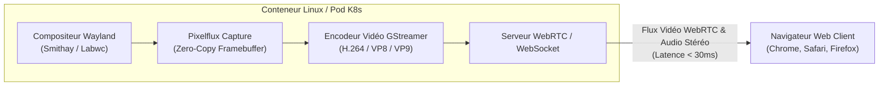

# Bureaux Linux dans le Navigateur : Pourquoi Selkies Enterre Définitivement VNC et KasmVNC

*Pendant près de trois décennies, accéder à une interface graphique Linux à distance rimait avec le protocole VNC. Aujourd'hui, l'émergence de Selkies et son adoption massive par LinuxServer.io marquent un saut générationnel : streaming WebRTC fluide à 60 FPS, faible latence (< 30 ms) et modernité Wayland directement dans un simple onglet de navigateur.*

---

## 📻 L'Épuisement du Protocole VNC (RFB)

Le protocole **RFB (Remote Framebuffer)** sur lequel repose VNC a été conçu à la fin des années 1990 :
1. **Transfert d'images par blocs rectangulaires** : VNC découpe l'écran en rectangles et envoie les différences d'images compressées (zlib, JPEG). Dès qu'une vidéo tourne ou qu'une fenêtre bouge rapidement, la bande passante explose et l'affichage saccade.
2. **Absence de son natif** : Transmettre l'audio nécessitait des bidouilles complexes (serveurs PulseAudio sur sockets TCP séparées).
3. **Même KasmVNC atteignait ses limites** : Bien qu'ayant modernisé VNC avec WebSockets et du rendu JPEG/WebP pour le web, KasmVNC restait prisonnier de l'architecture RFB et du vieux serveur d'affichage X11.

---

## ⚡ La Révolution Selkies : Le Modèle "Cloud Gaming" pour Linux

Initié par des ingénieurs de **Google** et développé conjointement avec la communauté open-source et l'équipe **LinuxServer.io**, **Selkies** réinvente totalement la diffusion graphique :

### Les 4 Piliers Technologiques de Selkies :
1. **WebRTC & Encodage Vidéo Moderne** :
   Au lieu d'envoyer des séries d'images statiques, Selkies encode l'écran sous forme d'un **véritable flux vidéo temps réel** (H.264 ou VP8/VP9) avec GStreamer. Le résultat est identique à un service de Cloud Gaming (GeForce Now, Moonlight, Parsec).
2. **Serveur d'affichage Wayland (Smithay / Labwc)** :
   Sortie définitive de X11 au profit de Wayland : isolation parfaite entre les fenêtres, meilleure sécurité et fluidité graphique native.
3. **Capture Framebuffer Zero-Copy (Pixelflux)** :
   Le moteur Pixelflux extrait les trames directement de la mémoire vidéo, éliminant les copies CPU inutiles.
4. **Audio Stéréo Bidirectionnel Intégré** :
   Transmis directement dans le flux WebRTC sans configuration complexe.

---

## 🔄 Le Choix Stratégique de LinuxServer.io : L'Adieu à KasmVNC

LinuxServer.io a officiellement **retiré et déprécié l'ensemble de ses images basées sur KasmVNC**.

La nouvelle fondation officielle est désormais **`docker-baseimage-selkies`**, qui propulse :
- **Webtop** (bureaux complets Ubuntu, Alpine, Arch, Fedora).
- **Les applications desktop autonomes** (Blender, Chromium, GIMP, LibreOffice, Wireshark, VS Code) streamées comme des micro-services isolés dans le navigateur.

---

## 🎯 Tableau Comparatif : VNC classique vs KasmVNC vs Selkies

| Critère | VNC classique (noVNC) | KasmVNC (Remplacé) | 🦭 Selkies (Nouvelle norme) |
| :--- | :--- | :--- | :--- |
| **Protocole réseau** | RFB sur WebSocket | RFB amélioré sur WebSocket | **WebRTC natif / WebSocket OCI** |
| **Compression** | JPEG / Raw (très lourd) | WebP / JPEG dynamique | **Flux Vidéo H.264 / VP8 / VP9** |
| **Latence ressentie** | 150 - 300 ms | 60 - 120 ms | **< 30 ms (temps réel)** |
| **Audio** | Inexistant | Expérimental | **Natif stéréo bidirectionnel** |
| **Serveur d'affichage** | X11 (vieux de 40 ans) | X11 | **Wayland moderne (Smithay)** |
| **Accélération GPU** | Très limitée | Partielle | **Complète (Nvidia, Intel DRI, AMD)** |

---

## 💡 Cas d'Usage en Homelab et Entreprise

1. **Bastion d'administration sécurisé** : Accéder à un bureau Linux complet depuis un iPad ou un PC nomade via HTTPS sans installer de client VPN lourd.
2. **Diagnostic réseau interne** : Lancer un conteneur Wireshark ou Postman directement dans les réseaux privés d'un cluster Kubernetes pour inspecter le trafic interne.
3. **Environnements de développement isolés** : Fournir un environnement de code complet sans aucune pollution de la machine hôte.

Selkies transforme le conteneur en un poste de travail graphique moderne, souverain et accessible en un clic.
