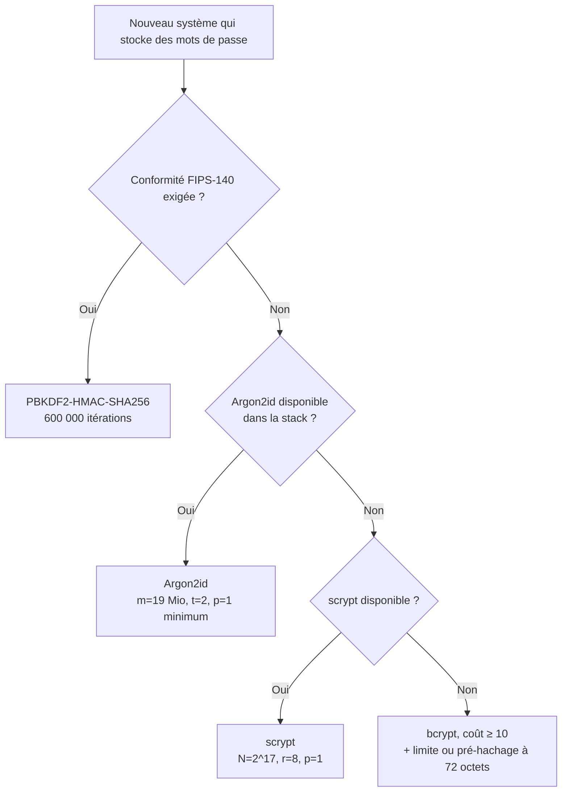

# Bien Choisir son Algorithme de Hachage de Mots de Passe : Argon2id, scrypt, bcrypt ou PBKDF2 ?

*On entend souvent parler de « crypter » les mots de passe. C'est justement ce qu'il ne faut pas faire : un mot de passe ne se chiffre pas, il se **hache**, avec un algorithme conçu pour être **lent**. Et c'est là que la plupart des bases de données se trompent.*

En déployant OpenLDAP dans [un précédent article](/blog/deploiement-openldap-docker-compose-secrets-traefik), j'ai stocké les mots de passe au format `{SSHA}` en notant que c'était « acceptable pour un lab ». Cet article explique pourquoi, et comment choisir correctement pour la production.

---

## 1. Chiffrer, hacher, dériver : trois choses différentes

| Opération | Réversible ? | Usage |
| :--- | :--- | :--- |
| **Chiffrement** (AES, RSA…) | Oui, avec la clé | Protéger une donnée qu'il faudra relire |
| **Hachage rapide** (SHA-256, SHA-1, MD5…) | Non | Intégrité, signatures, empreintes de fichiers |
| **Hachage de mot de passe / KDF** (Argon2id, scrypt, bcrypt, PBKDF2) | Non, et **volontairement coûteux** | Stocker des mots de passe |

Un mot de passe **chiffré** est un mot de passe en clair qui attend qu'on vole la clé, et la clé est presque toujours sur le même serveur. Le serveur n'a jamais besoin de relire le mot de passe : il lui suffit de recalculer l'empreinte et de la comparer. On hache donc.

## 2. Pourquoi SHA-256 (même salé) ne suffit pas

Les fonctions comme SHA-256 sont conçues pour être **rapides**. C'est parfait pour vérifier un fichier de plusieurs gigaoctets, et catastrophique pour un mot de passe : un seul GPU grand public calcule des **milliards** d'empreintes SHA par seconde. Une fois la base volée, l'attaquant teste hors ligne des dictionnaires entiers et leurs variantes, sans aucune limite de tentatives.

Le sel (`{SSHA}` = SHA-1 + sel) empêche les tables précalculées (rainbow tables) et oblige à attaquer chaque compte séparément. Il ne ralentit **pas** l'attaque sur un compte donné.

## 3. Les trois ingrédients d'un bon hachage de mot de passe

1. **Un sel unique par mot de passe** : aléatoire, d'au moins 128 bits selon le NIST (le standard PKCS #5 exige 64 bits minimum). Il est stocké avec l'empreinte. Les bibliothèques modernes le génèrent seules.
2. **Un facteur de coût réglable** : nombre d'itérations ou de tours, qu'on augmente au fil des années quand le matériel progresse.
3. **La dureté mémoire** (*memory-hardness*) : obliger chaque calcul à utiliser beaucoup de RAM. C'est ce qui rend les GPU et les ASIC peu rentables : ils ont énormément de cœurs de calcul, mais peu de mémoire par cœur.

En option, un **poivre** (*pepper*) : un secret commun à tous les mots de passe, stocké **hors de la base** (variable d'environnement, secret Docker, HSM ou coffre). Si seule la base fuit, les empreintes restent inexploitables.

## 4. Les quatre candidats

### PBKDF2 : le vétéran standardisé

[PBKDF2](https://en.wikipedia.org/wiki/PBKDF2) (*Password-Based Key Derivation Function 2*) vient du standard **PKCS #5 v2.0** de RSA Laboratories, publié sous la [RFC 2898](https://www.rfc-editor.org/rfc/rfc2898) en 2000, puis mis à jour par la [RFC 8018](https://www.rfc-editor.org/rfc/rfc8018) (PKCS #5 v2.1) en 2017.

Son principe : appliquer une fonction pseudo-aléatoire (en pratique HMAC-SHA256 ou HMAC-SHA512) des centaines de milliers de fois. Il prend cinq paramètres : la fonction (PRF), le mot de passe, le sel, le nombre d'itérations `c` et la longueur de clé voulue `dkLen`.

L'évolution de ses recommandations montre bien la course contre le matériel : **1 000** itérations minimum dans le standard de 2000, **600 000** pour HMAC-SHA256 aujourd'hui selon l'OWASP.

- ✅ Standardisé, disponible partout, **validé FIPS-140** : c'est souvent le seul choix possible dans un contexte réglementé.
- ❌ **Aucune dureté mémoire** : il tient dans un petit circuit avec très peu de RAM, donc les GPU et les ASIC l'attaquent à bas coût.

On le croise aussi hors du stockage de mots de passe : WPA2 dérive sa clé avec `PBKDF2(HMAC-SHA1, passphrase, ssid, 4096, 256)`.

### bcrypt : le classique robuste

Conçu en 1999 à partir du chiffrement Blowfish, bcrypt a un facteur de coût exponentiel (chaque +1 double le temps de calcul) et utilise un peu de mémoire, juste assez pour gêner les GPU.

- ✅ Éprouvé depuis plus de 25 ans, présent dans tous les langages.
- ❌ Dureté mémoire faible et fixe (4 Kio).
- ⚠️ **Limite de 72 octets** : au-delà, les anciennes implémentations **tronquaient sans rien dire**. Deux mots de passe longs au même début donnaient donc la même empreinte. Les versions récentes, comme `bcrypt` 5.0 en Python, lèvent désormais une erreur (`ValueError: password cannot be longer than 72 bytes`). Il faut soit limiter la longueur, soit pré-hacher (voir plus bas).

### scrypt : la dureté mémoire, première génération

Publié en 2009 ([RFC 7914](https://www.rfc-editor.org/rfc/rfc7914)), scrypt a été le premier algorithme largement utilisé qui impose une grande quantité de mémoire, réglable via `N` (coût CPU et mémoire), `r` (taille de bloc) et `p` (parallélisme).

- ✅ Très résistant aux GPU et aux ASIC quand il est bien paramétré.
- ❌ Paramètres liés entre eux et faciles à mal régler.

### Argon2id : le standard actuel

**Argon2** a gagné la *Password Hashing Competition* en 2015 et est standardisé par la [RFC 9106](https://www.rfc-editor.org/rfc/rfc9106). Il existe en trois variantes :

- **Argon2d** : accès mémoire dépendant des données. Très résistant aux GPU, mais exposé aux attaques par canaux auxiliaires.
- **Argon2i** : accès mémoire indépendant des données. Résiste aux canaux auxiliaires, mais est plus faible face au compromis temps/mémoire.
- **Argon2id** : un hybride des deux. **C'est la variante à utiliser.**

Ses trois paramètres sont indépendants et lisibles : `m` (mémoire en Kio), `t` (nombre de passes) et `p` (parallélisme).

## 5. Les paramètres recommandés (OWASP)

L'[OWASP Password Storage Cheat Sheet](https://cheatsheetseries.owasp.org/cheatsheets/Password_Storage_Cheat_Sheet.html) classe les algorithmes dans cet ordre : **Argon2id**, puis **scrypt**, puis **bcrypt** (systèmes existants), puis **PBKDF2** (si FIPS-140 est exigé). Paramètres minimaux :

| Algorithme | Configuration minimale | Mémoire |
| :--- | :--- | :--- |
| **Argon2id** | `m=47104, t=1, p=1` | 46 Mio |
| **Argon2id** | `m=19456, t=2, p=1` | 19 Mio |
| **Argon2id** | `m=12288, t=3, p=1` | 12 Mio |
| **Argon2id** | `m=9216, t=4, p=1` | 9 Mio |
| **Argon2id** | `m=7168, t=5, p=1` | 7 Mio |
| **scrypt** | `N=2^17, r=8, p=1` | 128 Mio |
| **scrypt** | `N=2^16, r=8, p=2` | 64 Mio |
| **scrypt** | `N=2^15, r=8, p=3` | 32 Mio |
| **scrypt** | `N=2^14, r=8, p=5` | 16 Mio |
| **scrypt** | `N=2^13, r=8, p=10` | 8 Mio |
| **bcrypt** | facteur de coût **≥ 10**, entrée ≤ 72 octets | 4 Kio (fixe) |
| **PBKDF2-HMAC-SHA256** | **600 000** itérations | négligeable |
| **PBKDF2-HMAC-SHA512** | **220 000** itérations | négligeable |
| **PBKDF2-HMAC-SHA1** | 1 400 000 itérations (systèmes existants uniquement) | négligeable |

Pour Argon2id et scrypt, les cinq configurations se valent : on échange de la mémoire contre du temps de calcul. Avec Argon2id, prenez celle qui correspond à la RAM disponible sur vos serveurs **au pic de connexions simultanées**.

## 6. L'arbre de décision



## 7. En pratique : calibrer, puis vérifier

Les valeurs OWASP sont des **minimums**. La bonne pratique est de mesurer sur votre matériel, puis de monter les paramètres tant que le temps de connexion reste acceptable pour vos utilisateurs et que la charge tient au pic.

Mesures sur mon poste (Python, `argon2-cffi` 25.1, `bcrypt` 5.0) :

| Algorithme et paramètres | Temps pour un hachage |
| :--- | :--- |
| Argon2id `m=19456, t=2, p=1` | ~21 ms |
| PBKDF2-HMAC-SHA256, 600 000 itérations | ~49 ms |
| bcrypt, coût 12 | ~172 ms |

Ces chiffres montrent que le temps seul ne dit pas tout. Argon2id est le plus rapide des trois pour un utilisateur légitime, mais chaque essai coûte 19 Mio de RAM à l'attaquant, ce que PBKDF2 n'impose jamais.

Exemple avec Argon2id en Python :

```python
from argon2 import PasswordHasher

# Paramètres OWASP : m=19 Mio, t=2, p=1 (memory_cost est en Kio)
ph = PasswordHasher(time_cost=2, memory_cost=19456, parallelism=1)

hash_ = ph.hash("correct horse battery staple")
# $argon2id$v=19$m=19456,t=2,p=1$<sel>$<empreinte>

ph.verify(hash_, "correct horse battery staple")  # lève une exception si le mot de passe est faux

# Après une connexion réussie : ré-hacher si les paramètres ont été relevés depuis
if ph.check_needs_rehash(hash_):
    hash_ = ph.hash("correct horse battery staple")
```

L'empreinte au format PHC (`$argon2id$v=19$m=…,t=…,p=…$sel$hash`) contient l'algorithme, les paramètres et le sel. On peut donc relever les paramètres à tout moment sans casser les anciens comptes : `check_needs_rehash` détecte ceux qui sont à mettre à jour.

## 8. Migrer sans forcer la réinitialisation

Deux stratégies, à combiner :

1. **Ré-hacher à la connexion** : quand un utilisateur se connecte, on a son mot de passe en clair pendant un instant. On le vérifie avec l'ancien algorithme, puis on stocke immédiatement une empreinte Argon2id.
2. **Envelopper les anciennes empreintes** pour les comptes inactifs : stocker `argon2id(sha1_legacy)` sans connaître le mot de passe. L'OWASP prévient que cet empilement peut rendre les empreintes plus faciles à casser : il faut les remplacer par une empreinte directe dès la connexion suivante.

Pour contourner la limite de 72 octets de bcrypt, l'OWASP propose un pré-hachage avec poivre :

```text
bcrypt(base64(hmac-sha384(data: password, key: pepper)), salt, cost)
```

L'encodage base64 évite les octets nuls, que certaines implémentations de bcrypt interprètent comme une fin de chaîne.

## 9. Cas concret : et OpenLDAP ?

Dans ma stack OpenLDAP, `slappasswd` produit du `{SSHA}` par défaut : SHA-1 salé, rapide, sans dureté mémoire. J'ai vérifié ce que permet l'image `osixia/openldap:1.5.0` (OpenLDAP **2.4.57**) :

| Schéma | Disponible ? | Remarque |
| :--- | :--- | :--- |
| `{SSHA}` | par défaut | rapide, à éviter en production |
| `{SSHA512}` | module `pw-sha2` | toujours un hachage rapide |
| `{CRYPT}` `$6$` (sha512crypt) | natif | coût réglable (`rounds=`), sans dureté mémoire |
| `{PBKDF2-SHA512}` | module `pw-pbkdf2` | **10 000** itérations par défaut, très en dessous des 220 000 recommandées |
| `{ARGON2}` | module `pw-argon2` | produit du **`argon2i`** avec `m=4096` (4 Mio) et `t=3` |

Activer Argon2 pour toutes les nouvelles empreintes (testé sur l'image) :

```ldif
dn: cn=module{0},cn=config
changetype: modify
add: olcModuleLoad
olcModuleLoad: pw-argon2

dn: olcDatabase={-1}frontend,cn=config
changetype: modify
replace: olcPasswordHash
olcPasswordHash: {ARGON2}
```

Tout mot de passe changé ensuite via `ldappasswd` (ou via l'overlay ppolicy avec `olcPPolicyHashCleartext`) est stocké en `{ARGON2}$argon2i$v=19$m=4096,t=3,p=1$…`, et l'authentification fonctionne normalement.

C'est **nettement mieux que `{SSHA}`**, mais on reste loin des recommandations : variante `argon2i` au lieu d'`argon2id`, et 4 Mio de mémoire au lieu de 19 Mio. Dans cette version, je n'ai trouvé aucun moyen de régler ces paramètres. OpenLDAP **2.5 et suivants** intègre le module `argon2` en standard, avec des paramètres réglables au chargement (voir la page de manuel `slappw-argon2(5)`). Pour de la production, c'est une bonne raison de passer à une version récente d'OpenLDAP.

## Conclusion

- **Ne chiffrez pas** les mots de passe, et ne les hachez pas avec SHA-256 ou MD5, même salés.
- **Par défaut : Argon2id**, avec au minimum `m=19 Mio, t=2, p=1`, puis calibré sur votre matériel.
- **PBKDF2** seulement si FIPS-140 l'impose, avec au moins 600 000 itérations en HMAC-SHA256.
- **bcrypt** reste acceptable sur l'existant, en gérant la limite de 72 octets.
- Stockez le format complet (`$argon2id$…`) et **ré-hachez à la connexion** pour faire évoluer les paramètres sans douleur.
- Vérifiez ce que votre stack produit **réellement** : un « support d'Argon2 » peut cacher des paramètres faibles et figés.

### Glossaire

| Terme | Signification |
| :--- | :--- |
| **ASIC** | *Application-Specific Integrated Circuit* : puce conçue pour une seule tâche (par exemple calculer du SHA-256 pour miner du Bitcoin), bien plus rapide et économe qu'un CPU ou un GPU pour cette tâche. |
| **Attaque par canal auxiliaire** | Attaque qui exploite des indices physiques de l'exécution (temps de calcul, accès mémoire, consommation électrique) plutôt que l'algorithme lui-même. |
| **Dureté mémoire** (*memory-hardness*) | Propriété d'un algorithme qui impose d'utiliser beaucoup de RAM par calcul, ce qui rend les attaques sur GPU et ASIC peu rentables. |
| **FIPS-140** | Norme américaine (NIST) de validation des modules cryptographiques, souvent exigée dans le secteur public, la santé ou la finance. |
| **GPU** | *Graphics Processing Unit* : carte graphique, avec des milliers de cœurs de calcul, très efficace pour tester des mots de passe en parallèle. |
| **HMAC** | *Hash-based Message Authentication Code* : hachage combiné à une clé secrète (par exemple HMAC-SHA256). PBKDF2 l'utilise comme fonction de base. |
| **HSM** | *Hardware Security Module* : boîtier ou carte matérielle qui stocke des clés et fait des calculs cryptographiques sans jamais exposer les clés. |
| **KDF** | *Key Derivation Function*, fonction de dérivation de clé : transforme un secret (souvent un mot de passe) en clé cryptographique, avec un sel et un coût réglable. |
| **OWASP** | *Open Worldwide Application Security Project* : fondation qui publie des références de sécurité applicative, dont les *Cheat Sheets*. |
| **PHC** | *Password Hashing Competition* (2013-2015), remportée par Argon2. Désigne aussi le format d'empreinte `$algo$v=…$paramètres$sel$hash`. |
| **Poivre** (*pepper*) | Secret commun à tous les mots de passe, stocké hors de la base, qui rend les empreintes inexploitables si seule la base fuit. |
| **PRF** | *Pseudo-Random Function*, fonction pseudo-aléatoire : la brique répétée par PBKDF2, en pratique HMAC-SHA256 ou HMAC-SHA512. |
| **Rainbow table** | Table précalculée d'empreintes de mots de passe courants. Le sel la rend inutilisable. |
| **Sel** (*salt*) | Valeur aléatoire unique par mot de passe, stockée avec l'empreinte, pour que deux mots de passe identiques donnent deux empreintes différentes. |

### Références utiles :
- [PBKDF2 — Wikipedia](https://en.wikipedia.org/wiki/PBKDF2)
- [OWASP Password Storage Cheat Sheet](https://cheatsheetseries.owasp.org/cheatsheets/Password_Storage_Cheat_Sheet.html)
- [RFC 9106 — Argon2](https://www.rfc-editor.org/rfc/rfc9106)
- [RFC 8018 — PKCS #5 v2.1 (PBKDF2)](https://www.rfc-editor.org/rfc/rfc8018)
- [RFC 7914 — scrypt](https://www.rfc-editor.org/rfc/rfc7914)
- [NIST SP 800-63B — Digital Identity Guidelines](https://pages.nist.gov/800-63-4/sp800-63b.html)
- [Déploiement sécurisé d'OpenLDAP avec Docker Compose](/blog/deploiement-openldap-docker-compose-secrets-traefik)
